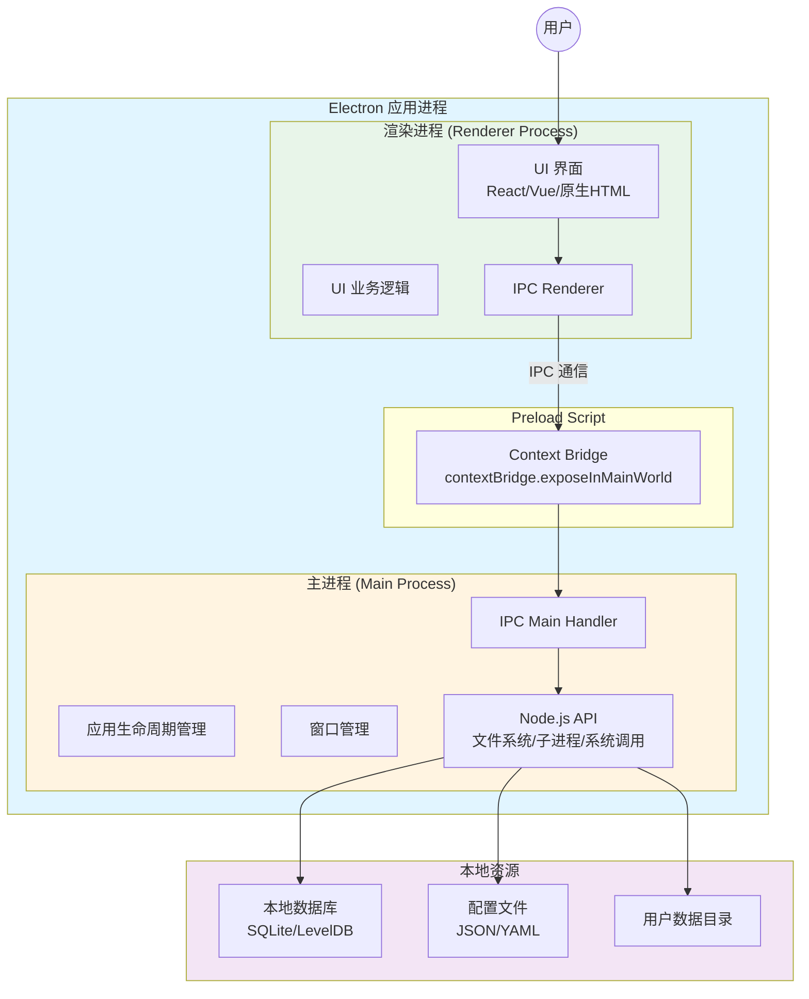
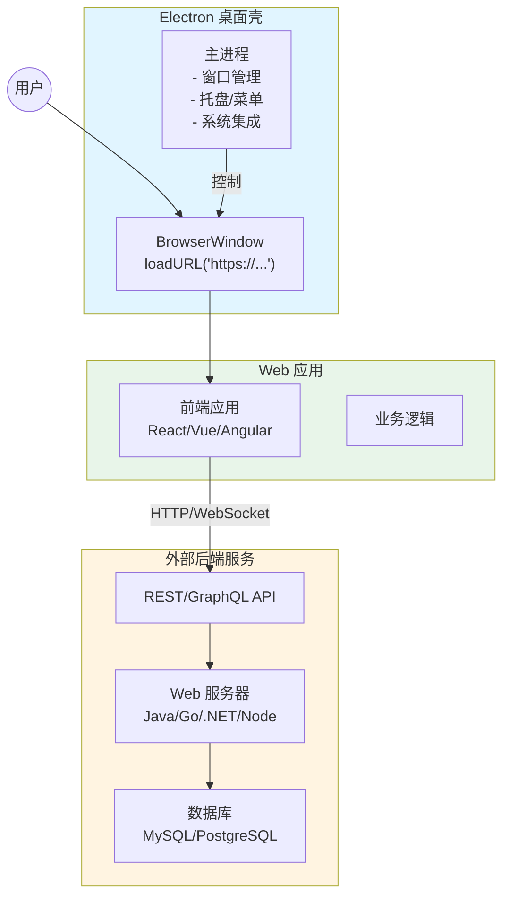
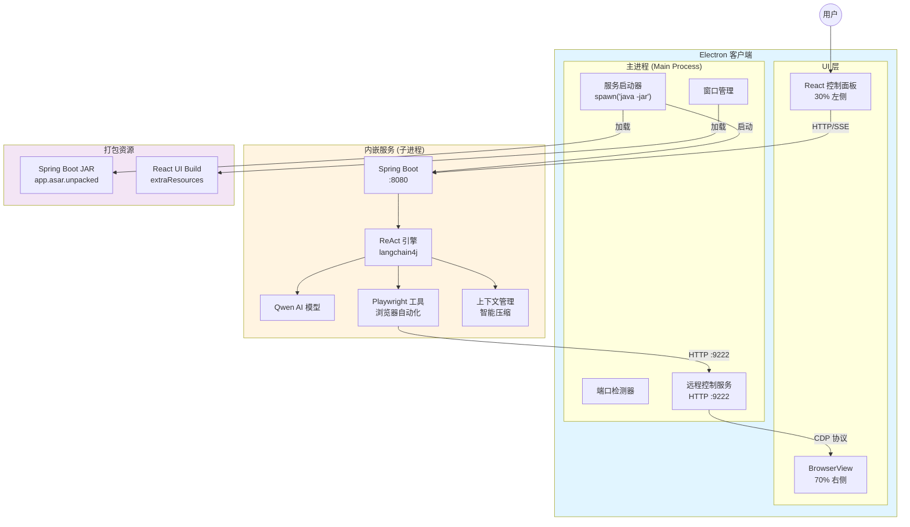

# Electron 客户端架构模式对比

## 📋 概述

本文档对比分析三种主流的 Electron 客户端架构模式，帮助团队理解当前项目的架构选型依据，以及不同模式的适用场景。

---

## 🏗️ 三种架构模式

### 模式 A：原生 Electron 模式（Pure Electron）

**核心特征：纯 Node.js + 浏览器，无外部 HTTP 服务**



**技术栈：**
- **主进程**：Node.js + Electron API
- **渲染进程**：HTML/CSS/JS（可使用 React/Vue/Angular）
- **通信方式**：IPC（`ipcMain` / `ipcRenderer`）
- **数据存储**：本地文件系统 / SQLite / IndexedDB

**代码示例：**

```javascript
// main.js - 主进程
const { app, BrowserWindow, ipcMain } = require('electron');
const fs = require('fs').promises;

ipcMain.handle('read-config', async () => {
  const data = await fs.readFile('config.json', 'utf-8');
  return JSON.parse(data);
});

ipcMain.handle('save-data', async (event, data) => {
  await fs.writeFile('data.json', JSON.stringify(data));
  return { success: true };
});
```

```javascript
// preload.js - 预加载脚本
const { contextBridge, ipcRenderer } = require('electron');

contextBridge.exposeInMainWorld('electronAPI', {
  readConfig: () => ipcRenderer.invoke('read-config'),
  saveData: (data) => ipcRenderer.invoke('save-data', data),
});
```

```javascript
// renderer.js - 渲染进程
const config = await window.electronAPI.readConfig();
await window.electronAPI.saveData({ user: 'test' });
```

---

### 模式 B：Electron + Web 应用壳模式（Desktop Wrapper）

**核心特征：Electron 作为现有 Web 应用的桌面容器**



**技术栈：**
- **Electron**：仅提供桌面容器和系统集成
- **前端**：已有的 Web 应用（独立开发/部署）
- **后端**：独立的 HTTP 服务（可以是云端或本地）
- **通信方式**：HTTP/WebSocket（前端 ↔ 后端）

**适用场景：**
- 已有成熟的 Web 应用，需要快速推出桌面版
- SaaS 产品需要提供离线能力
- 内网应用需要统一桌面入口

**代码示例：**

```javascript
// main.js
const { app, BrowserWindow } = require('electron');

function createWindow() {
  const win = new BrowserWindow({
    width: 1200,
    height: 800,
  });
  
  // 加载已有的 Web 应用
  win.loadURL('https://app.internal.company.com');
  // 或本地开发服务器
  // win.loadURL('http://localhost:3000');
}

app.whenReady().then(createWindow);
```

---

### 模式 C：Electron + 内嵌后端服务模式（Embedded Backend）

**核心特征：Electron 内嵌并管理本地后端服务（当前项目采用）**



**技术栈：**
- **Electron**：UI 容器 + 进程管理器 + BrowserView 控制
- **后端**：Spring Boot + langchain4j + Qwen AI
- **浏览器自动化**：Playwright（通过远程控制）
- **通信方式**：
  - React UI ↔ Spring Boot：HTTP + SSE (8080)
  - Spring Boot ↔ BrowserView：HTTP (9222)
  - Electron 主进程 ↔ UI：IPC

**核心实现：**

```javascript
// main.js - 启动内嵌服务
const { spawn } = require('child_process');
const path = require('path');

async function startSpringBoot() {
  const jarPath = isDev 
    ? path.join(__dirname, '../react-mcp-demo/target/react-mcp-demo-0.0.1-SNAPSHOT.jar')
    : path.join(process.resourcesPath, 'app.asar.unpacked/spring-boot-server/react-mcp-demo-0.0.1-SNAPSHOT.jar');
  
  const javaProcess = spawn('java', ['-jar', jarPath], {
    cwd: path.dirname(jarPath),
    stdio: 'pipe'
  });
  
  javaProcess.stdout.on('data', (data) => {
    console.log(`[Spring Boot] ${data}`);
  });
  
  return javaProcess;
}

app.whenReady().then(async () => {
  const available = await isPortAvailable(8080);
  if (available) {
    await startSpringBoot();
  }
  createWindow();
});
```

**打包配置：**

```json
{
  "build": {
    "asarUnpack": [
      "spring-boot-server/**/*"
    ],
    "extraResources": [
      {
        "from": "react-ui/build",
        "to": "react-ui/build"
      },
      {
        "from": "spring-boot-server",
        "to": "app.asar.unpacked/spring-boot-server"
      }
    ]
  }
}
```

---

## 📊 深度对比分析

### 1. 架构复杂度

| 维度 | 原生 Electron | Web 应用壳 | 内嵌后端服务（当前） |
|------|--------------|-----------|---------------------|
| **进程数量** | 2 个<br/>（主进程 + 渲染进程） | 2-3 个<br/>（+ 可选外部服务） | 3+ 个<br/>（主进程 + 渲染进程 + Java 子进程） |
| **技术栈** | 单一（JS/TS + Node） | 分离（Electron + Web 前后端） | 混合（JS + Java + AI 框架） |
| **通信复杂度** | 简单（IPC） | 中等（HTTP） | 复杂（IPC + HTTP + CDP） |
| **学习曲线** | ⭐⭐ 中等 | ⭐ 低 | ⭐⭐⭐ 高 |
| **调试难度** | ⭐⭐ 中等 | ⭐⭐ 中等 | ⭐⭐⭐⭐ 高 |

**分析：**

- **原生模式**：架构最简单，所有逻辑在 Node 生态内，调试工具完善
- **Web 壳模式**：前后端职责清晰，但 Electron 功能利用率低
- **内嵌后端模式**：架构最复杂，但职责分离清晰，适合大型项目

---

### 2. 性能表现

| 维度 | 原生 Electron | Web 应用壳 | 内嵌后端服务 |
|------|--------------|-----------|-------------|
| **启动速度** | ⭐⭐⭐⭐⭐ 快<br/>（1-2 秒） | ⭐⭐⭐⭐ 较快<br/>（取决于网络） | ⭐⭐⭐ 中等<br/>（3-5 秒，需启动 JVM） |
| **内存占用** | ⭐⭐⭐⭐ 低<br/>（100-200 MB） | ⭐⭐⭐⭐ 低<br/>（100-300 MB） | ⭐⭐ 高<br/>（500-800 MB，含 JVM） |
| **CPU 占用** | ⭐⭐⭐⭐ 低 | ⭐⭐⭐⭐ 低 | ⭐⭐⭐ 中等<br/>（AI 推理时较高） |
| **响应速度** | ⭐⭐⭐⭐⭐ 极快<br/>（本地调用） | ⭐⭐⭐ 中等<br/>（网络延迟） | ⭐⭐⭐⭐ 快<br/>（本地 HTTP，有开销） |
| **流式处理** | ⭐⭐⭐ 支持但较复杂 | ⭐⭐⭐⭐ 原生支持 SSE | ⭐⭐⭐⭐⭐ 完美支持<br/>（SSE + 实时推流） |

**分析：**

- **原生模式**：性能最优，但流式处理需要额外实现
- **Web 壳模式**：性能取决于网络和后端，离线能力弱
- **内嵌后端模式**：内存占用较高，但提供了强大的 AI 能力和流式体验

---

### 3. 开发体验

| 维度 | 原生 Electron | Web 应用壳 | 内嵌后端服务 |
|------|--------------|-----------|-------------|
| **技术栈统一性** | ⭐⭐⭐⭐⭐ 全栈 JS/TS | ⭐⭐⭐ 前后端分离 | ⭐⭐ 多语言混合 |
| **开发效率** | ⭐⭐⭐⭐ 高<br/>（热重载 + 快速迭代） | ⭐⭐⭐⭐⭐ 极高<br/>（复用 Web 应用） | ⭐⭐⭐ 中等<br/>（需协调多项目） |
| **调试便利性** | ⭐⭐⭐⭐ 好<br/>（Chrome DevTools） | ⭐⭐⭐⭐ 好<br/>（Web 调试工具） | ⭐⭐ 一般<br/>（需要多工具配合） |
| **团队协作** | ⭐⭐⭐ 需要全栈能力 | ⭐⭐⭐⭐⭐ 前后端独立 | ⭐⭐⭐⭐ 职责清晰<br/>（前端/后端/AI） |
| **错误排查** | ⭐⭐⭐⭐ 相对简单 | ⭐⭐⭐ 跨系统排查 | ⭐⭐ 复杂<br/>（跨进程/跨语言） |

**分析：**

- **原生模式**：对前端开发者友好，但缺乏企业级后端能力
- **Web 壳模式**：最高效，但 Electron 能力利用不足
- **内嵌后端模式**：开发复杂度高，但适合大团队分工协作

---

### 4. 部署与分发

| 维度 | 原生 Electron | Web 应用壳 | 内嵌后端服务 |
|------|--------------|-----------|-------------|
| **安装包大小** | ⭐⭐⭐⭐ 小<br/>（50-100 MB） | ⭐⭐⭐⭐⭐ 极小<br/>（30-50 MB） | ⭐⭐ 大<br/>（150-300 MB，含 JRE） |
| **一体化程度** | ⭐⭐⭐⭐⭐ 完全一体 | ⭐ 依赖外部服务 | ⭐⭐⭐⭐⭐ 完全一体 |
| **离线能力** | ⭐⭐⭐⭐⭐ 完全离线 | ⭐ 需要网络 | ⭐⭐⭐⭐⭐ 完全离线 |
| **更新成本** | ⭐⭐⭐ 需重新打包 | ⭐⭐⭐⭐⭐ 热更新<br/>（仅更新 Web） | ⭐⭐⭐ 需重新打包<br/>（前端可分离） |
| **平台兼容性** | ⭐⭐⭐⭐⭐ 跨平台 | ⭐⭐⭐⭐⭐ 跨平台 | ⭐⭐⭐⭐ 跨平台<br/>（需要对应 JRE） |
| **依赖管理** | ⭐⭐⭐⭐ 简单 | ⭐⭐⭐⭐⭐ 独立管理 | ⭐⭐ 复杂<br/>（Maven + npm） |

**分析：**

- **原生模式**：最轻量，适合快速分发
- **Web 壳模式**：依赖外部服务，灵活性高但离线能力弱
- **内嵌后端模式**：安装包较大，但一键安装、完全离线

---

### 5. 业务能力

| 维度 | 原生 Electron | Web 应用壳 | 内嵌后端服务 |
|------|--------------|-----------|-------------|
| **AI 能力** | ⭐⭐ 依赖第三方库 | ⭐⭐⭐⭐ 依赖后端 | ⭐⭐⭐⭐⭐ 原生集成<br/>（langchain4j + Qwen） |
| **浏览器自动化** | ⭐⭐⭐ Puppeteer/Playwright | ⭐⭐⭐⭐ 后端实现 | ⭐⭐⭐⭐⭐ 深度集成<br/>（BrowserView + Playwright） |
| **流式交互** | ⭐⭐ 需要额外实现 | ⭐⭐⭐⭐ SSE 原生支持 | ⭐⭐⭐⭐⭐ 完整 ReAct 流式<br/>（思考 → 行动 → 观察） |
| **企业级能力** | ⭐⭐ 受限于 Node | ⭐⭐⭐⭐⭐ 完整后端 | ⭐⭐⭐⭐⭐ Java 企业生态<br/>（Spring Boot） |
| **扩展性** | ⭐⭐⭐ 中等 | ⭐⭐⭐⭐⭐ 极强<br/>（独立演进） | ⭐⭐⭐⭐ 强<br/>（前后端可独立扩展） |

**分析：**

- **原生模式**：适合轻量级应用，AI 能力受限
- **Web 壳模式**：业务能力完全取决于后端服务
- **内嵌后端模式**：企业级 + AI 能力最强，适合复杂业务场景

---

### 6. 安全性

| 维度 | 原生 Electron | Web 应用壳 | 内嵌后端服务 |
|------|--------------|-----------|-------------|
| **代码保护** | ⭐⭐ JS 易被反编译 | ⭐⭐⭐⭐ 后端代码不暴露 | ⭐⭐⭐⭐ 后端代码打包为 JAR |
| **数据安全** | ⭐⭐⭐ 本地存储 | ⭐⭐⭐⭐ 集中管理 | ⭐⭐⭐⭐ 本地隔离 + 加密 |
| **网络安全** | ⭐⭐⭐⭐⭐ 无网络依赖 | ⭐⭐ 依赖 HTTPS | ⭐⭐⭐⭐ 本地回环<br/>（localhost） |
| **权限控制** | ⭐⭐⭐ 基于 IPC | ⭐⭐⭐⭐⭐ 完整鉴权体系 | ⭐⭐⭐⭐ Spring Security |
| **审计追踪** | ⭐⭐ 需要额外实现 | ⭐⭐⭐⭐⭐ 后端日志 | ⭐⭐⭐⭐⭐ 完整日志体系 |

**分析：**

- **原生模式**：代码易被逆向，但无网络攻击面
- **Web 壳模式**：安全性依赖后端实现
- **内嵌后端模式**：后端代码受保护，本地网络安全性高

---

### 7. 适用场景

| 场景 | 原生 Electron | Web 应用壳 | 内嵌后端服务 |
|------|--------------|-----------|-------------|
| **个人工具/小型应用** | ⭐⭐⭐⭐⭐ 最佳 | ⭐⭐⭐ 可用 | ⭐ 过度设计 |
| **企业内部工具** | ⭐⭐⭐ 可用 | ⭐⭐⭐⭐ 推荐 | ⭐⭐⭐⭐⭐ 最佳 |
| **SaaS 桌面版** | ⭐⭐ 不推荐 | ⭐⭐⭐⭐⭐ 最佳 | ⭐⭐⭐ 可用 |
| **AI 驱动应用** | ⭐⭐ 能力受限 | ⭐⭐⭐⭐ 依赖后端 | ⭐⭐⭐⭐⭐ 最佳 |
| **离线优先应用** | ⭐⭐⭐⭐⭐ 最佳 | ⭐ 不适合 | ⭐⭐⭐⭐⭐ 最佳 |
| **集团内部分发** | ⭐⭐⭐ 可用 | ⭐⭐ 依赖基础设施 | ⭐⭐⭐⭐⭐ 最佳 |
| **浏览器自动化** | ⭐⭐⭐ Puppeteer | ⭐⭐⭐⭐ 后端实现 | ⭐⭐⭐⭐⭐ 深度集成 |

---

## 🎯 当前项目选型分析

### 为什么选择「内嵌后端服务模式」？

基于当前项目的技术背景和业务需求，选择模式 C 的核心理由：

#### 1. **业务需求驱动**

✅ **ReAct 框架 + AI 推理**
- 需要强大的 AI 编排能力（langchain4j）
- 需要与 Qwen 大模型深度集成
- 原生 Electron（Node.js）的 AI 库生态不如 Java 成熟

✅ **浏览器自动化**
- 需要 Playwright 的完整能力
- 需要与 BrowserView 深度集成
- 需要实时控制和状态同步

✅ **流式交互体验**
- ReAct 的「思考 → 行动 → 观察」流程需要流式推送
- SSE 长连接在 Spring Boot 中实现成熟
- 前端需要实时展示 AI 推理过程

#### 2. **技术栈沉淀**

✅ **集团 Java 生态**
- 项目为大集团内部使用
- 团队有丰富的 Java + Spring Boot 经验
- 复用现有的企业级框架和组件

✅ **AI 框架成熟度**
- langchain4j 对 Java 开发者友好
- 与 Qwen/阿里云 DashScope 集成完善
- 企业级日志、监控、安全能力

#### 3. **部署模式要求**

✅ **一体化分发**
- 子公司用户无需安装配置后端服务
- 一键安装 DMG/EXE 即可使用
- 完全离线运行，无网络依赖

✅ **内网环境适配**
- 很多子公司处于内网隔离环境
- 不依赖外部云服务或 API
- 数据安全、本地化部署

#### 4. **工程化优势**

✅ **职责清晰**
- Electron：UI 容器 + 进程管理 + BrowserView 控制
- Spring Boot：ReAct 引擎 + AI 推理 + 工具编排
- React：控制面板 + 日志展示

✅ **可独立开发**
- 前端团队：React UI + Electron 打包
- 后端团队：Spring Boot API + AI 工具
- 两个团队可以并行迭代

✅ **可独立部署**
- 虽然打包在一起，但后端可以单独启动调试
- `./start-backend.sh` 可以脱离 Electron 运行
- 便于接口测试和性能分析

---

### 架构优势总结

| 优势维度 | 说明 |
|---------|------|
| **🤖 AI 能力** | langchain4j + Qwen 提供企业级 AI 编排能力 |
| **🎭 浏览器自动化** | BrowserView + Playwright 深度集成，实时控制 |
| **⚡ 流式体验** | SSE 完整支持 ReAct 流式推理过程 |
| **📦 一体化分发** | 一键安装，无需额外配置，完全离线 |
| **🔒 安全隔离** | 本地回环通信，数据不出本地 |
| **🏢 企业级能力** | Spring Boot 生态，日志、监控、安全完善 |
| **👥 团队协作** | 前后端职责清晰，可并行开发 |
| **🔧 可维护性** | 后端可独立调试，便于排查问题 |

---

### 架构劣势与应对

| 劣势 | 影响 | 应对措施 |
|------|------|---------|
| **安装包较大** | 150-300 MB | 可接受（内部使用，网络条件好） |
| **内存占用高** | 500-800 MB | 现代电脑配置足够，可优化 JVM 参数 |
| **启动时间长** | 3-5 秒 | 优化 JVM 启动，用户可接受 |
| **调试复杂** | 跨进程/跨语言 | 提供独立启动脚本，分离调试 |
| **依赖 JRE** | 需要 Java 17+ | 打包时可以内嵌 JRE（增加约 50MB） |

**结论：对于当前「集团内部 + AI 驱动 + 浏览器自动化」的场景，劣势可控，优势明显。**

---

## 📚 参考资料

### Electron 官方文档
- [Electron 架构概览](https://www.electronjs.org/docs/latest/tutorial/process-model)
- [进程间通信](https://www.electronjs.org/docs/latest/tutorial/ipc)
- [安全最佳实践](https://www.electronjs.org/docs/latest/tutorial/security)

### 社区最佳实践
- [electron-react-boilerplate](https://github.com/electron-react-boilerplate/electron-react-boilerplate)
- [Electron Builder 打包配置](https://www.electron.build/)

### 当前项目相关
- [langchain4j 官方文档](https://docs.langchain4j.dev/)
- [Playwright Java 文档](https://playwright.dev/java/)
- [Spring Boot 官方文档](https://spring.io/projects/spring-boot)

---

## 🔄 版本历史

| 版本 | 日期 | 修改内容 |
|------|------|---------|
| v1.0 | 2024-12-12 | 初始版本，三种架构模式对比分析 |

---

**文档维护者：** 架构组  
**最后更新：** 2024-12-12  
**适用项目：** ReAct MCP 客户端
