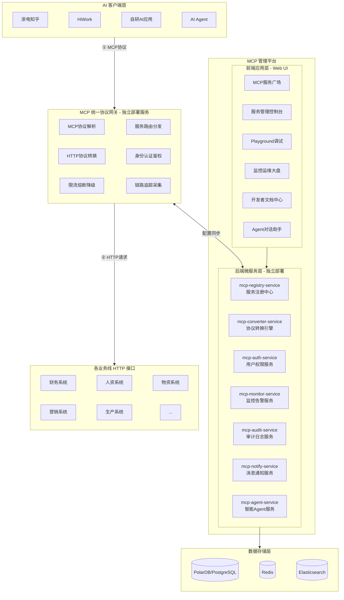
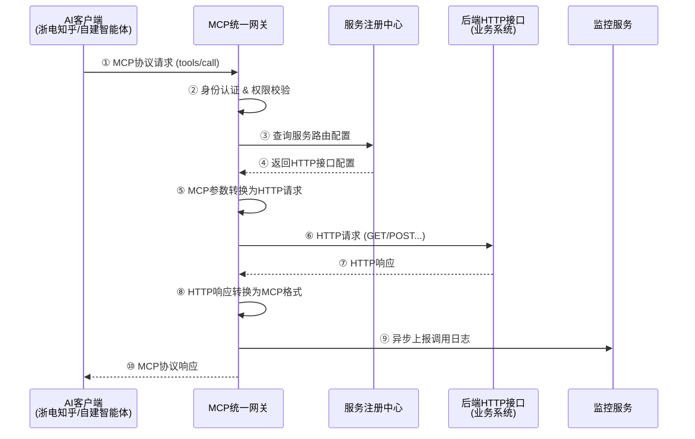
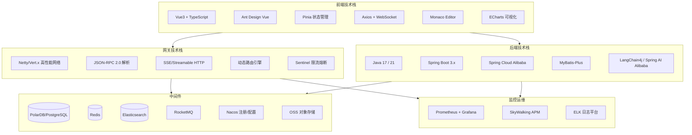
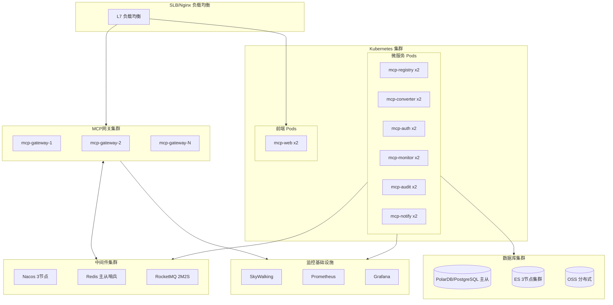
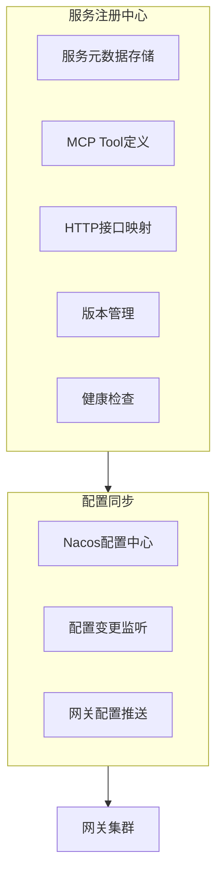

# MCP 协议集成管理平台 - 需求功能清单

*文档版本：v2.0*  
*作者：林强*  
*更新日期：2025年12月04日*

## 产品定位

### 产品概述

MCP（Model Context Protocol）协议集成管理平台是**企业级AI能力统一接入与治理中心**，采用统一网关模式架构。平台包含两大核心组成部分：

1. **MCP服务广场**：MCP服务发现与展示中心，汇聚各业务线的MCP服务，提供服务浏览、搜索、评分、收藏、Playground在线测试等能力，促进MCP服务的共享与复用。

2. **MCP协议转换引擎**：将各业务线现有的HTTP业务接口无缝转换为MCP协议服务，支持可视化配置、OpenAPI导入、参数映射等，无需改造现有系统即可快速生成MCP服务。

通过统一协议网关，让AI应用（如浙电知乎、内部自建Agent等）能够直接调用广场中的通用MCP服务和企业内部业务能力，实现AI与业务系统的深度融合。

### 产品背景

随着大语言模型和AI工具的快速发展，企业面临两大挑战：

1. **服务发现与共享难**：各业务线开发的MCP服务分散在各系统，缺乏统一的服务目录和展示平台，导致服务难以被发现和复用。参考ModelScope MCP广场、mcp.so等平台的成功经验，需要建立统一的MCP服务广场来汇聚和展示服务。

2. **现有系统接入难**：企业需要将内部业务系统的能力开放给AI应用调用，但改造现有系统成本高、周期长。

MCP（Model Context Protocol）作为Anthropic提出的开放标准协议，已成为AI工具与外部系统交互的主流规范。本平台旨在：
- 通过**MCP服务广场**建立统一的服务发现与展示中心，促进服务共享与复用
- 通过**协议转换引擎**降低接入门槛，无需改造现有系统，即可快速将HTTP接口升级为MCP服务

### 核心价值

| 价值维度 | 详细说明 |
|---------|----------|
| **零代码快速接入** | 各业务线无需部署任何服务，只需在平台上注册HTTP接口配置，即可生成MCP服务 |
| **统一协议网关** | 统一部署MCP协议网关，自动处理协议转换、认证鉴权、流量控制 |
| **可视化配置** | 提供友好的Web管理界面，通过可视化配置完成接口导入、参数映射、服务发布 |
| **全链路可观测** | 完整的调用监控、链路追踪、告警通知，保障服务稳定运行 |
| **企业级安全** | 对接ISC、SSO、RBAC权限控制、审计日志，满足企业安全合规要求 |
| **服务广场运营** | 类似ModelScope MCP广场的服务发现与展示中心，促进服务共享与复用 |

### 核心能力

- **HTTP接口转MCP协议**：支持OpenAPI/Swagger导入、手动配置、可视化参数映射，将HTTP接口无缝转换为MCP Tools
- **统一协议网关**：支持MCP协议解析、服务路由、协议转换、负载均衡、熔断降级
- **服务注册与发现**：完整的服务生命周期管理，支持多版本、健康检查、灰度发布
- **MCP服务广场**：提供服务浏览、搜索、评分、收藏等能力，促进服务共享
- **在线测试Playground**：提供Web端在线调试环境，实时测试MCP服务调用
- **全链路监控告警**：调用量统计、响应时间监控、错误率告警、链路追踪
- **企业级安全管控**：ISC集成、SSO集成、RBAC权限、操作审计、数据隔离

### 使用场景

| 场景 | 描述 |
|------|------|
| **智能体编排** | 开发人员在构建AI Agent时，可从服务广场快速发现并集成所需的MCP服务，构建更丰富的智能体应用场景 |
| **AI办公助手** | 员工使用AI工具，直接查询财务报表、提交审批流程、查询信息 |
| **智能开发助手** | 开发人员通过AI IDE直接调用内部API文档、查询系统配置、执行自动化操作 |
| **业务流程自动化** | AI Agent编排调用多个业务系统接口，实现跨系统业务流程自动化 |
| **数据查询分析** | AI工具通过MCP协议访问企业数据服务，进行智能数据分析和报表生成 |

---

## 系统架构

### 整体架构图



### 服务模块说明

| 服务/模块名 | 部署方式 | 类型 | 职责说明 |
|------------|---------|------|----------|
| **MCP统一协议网关** | 集群部署 | 独立服务 | 系统核心入口，负责MCP协议解析、路由分发、HTTP协议转换、认证鉴权、限流熔断、链路追踪 |
| **mcp-registry-service** | 独立部署 | 微服务 | 服务注册中心，管理服务元数据、生命周期、版本、路由配置，为网关提供服务发现能力 |
| **mcp-converter-service** | 独立部署 | 微服务 | **协议转换引擎**，HTTP接口转MCP服务的核心能力，处理OpenAPI导入、参数映射、响应转换 |
| **mcp-auth-service** | 独立部署 | 微服务 | 用户认证与权限管理，SSO对接、角色权限、Token管理、访问控制 |
| **mcp-monitor-service** | 独立部署 | 微服务 | 监控告警服务，调用量统计、性能监控、健康检查、告警规则、通知推送 |
| **mcp-audit-service** | 独立部署 | 微服务 | 审计日志服务，操作日志记录、调用日志存储、审计报表查询 |
| **mcp-notify-service** | 独立部署 | 微服务 | 消息通知服务，站内信、邮件、企业IM（钉钉/飞书/企微）等多渠道通知 |
| **MCP服务广场** | Web应用 | 前端模块 | **服务发现与展示中心**，服务浏览、搜索、评分、收藏、详情展示 |
| **服务管理控制台** | Web应用 | 前端模块 | 服务注册、配置、发布、版本管理的管理界面 |
| **Playground调试** | Web应用 | 前端模块 | 在线MCP服务测试调试环境，支持用例管理、批量测试 |
| **监控运维大盘** | Web应用 | 前端模块 | 调用统计、健康状态、告警展示的可视化大盘 |
| **开发者文档中心** | Web应用 | 前端模块 | API文档、接入指南、最佳实践等开发者资源 |
| **Agent对话助手** | Web应用 | 前端模块 | **智能Agent交互界面**，自然语言对话、推理过程展示、任务执行历史 |
| **mcp-agent-service** | 独立部署 | 微服务 | **智能Agent服务**，基于ReAct框架的推理引擎，LLM集成、多工具编排、异常恢复 |

### 架构分层说明

| 层次 | 职责说明 |
|------|----------|
| **AI客户端层** | 各类支持MCP协议的AI工具和应用（浙电知乎、HiWork、自研AI应用、AI Agent），通过MCP协议与网关通信 |
| **MCP统一协议网关** | 系统的核心入口，**独立部署的高性能服务**，负责MCP协议解析、服务路由、HTTP协议转换、安全管控、流量控制 |
| **前端应用层** | Web管理界面，包含 **MCP服务广场**（服务发现中心）、服务管理控制台、Playground调试、监控大盘、文档中心、**Agent对话助手** |
| **后端微服务层** | **7个独立部署的微服务**，其中 **mcp-converter-service（协议转换引擎）** 是将HTTP接口转为MCP服务的核心能力，**mcp-agent-service（智能Agent服务）** 提供基于ReAct框架的智能任务编排能力 |
| **业务系统层** | 各业务线现有的HTTP API，无需任何改造 |
| **数据存储层** | PolarDB/PostgreSQL（业务数据）、Redis（缓存/会话）、Elasticsearch（日志/搜索） |

### 调用流程时序图



---

## 一、MCP 服务广场（12个功能点）

> 类似 ModelScope MCP广场 / mcp.so 的服务发现与展示中心，为用户提供直观的服务浏览、搜索、评价体验。

| 编号 | 功能名称 | 优先级 | 界面 | 功能详细描述 |
|------|---------|:------:|:------:|-------------|
| 1.1 | **广场首页门户** | ★★★ | 页面 | 提供类似MCP广场的首页界面，顶部展示搜索框和分类导航，下方分区展示精选推荐、热门服务、最新上线等不同维度的服务列表，支持Tab切换不同视图（全部/精选/热门/最新），首页数据定期刷新确保内容时效性。 |
| 1.2 | **服务卡片组件** | ★★★ | 页面 | 设计标准化的MCP服务展示卡片，卡片包含服务图标/Logo、服务名称、简介描述、提供方（业务线）标识、工具数量徽章、调用量统计、评分星级、健康状态指示灯、收藏按钮等元素，卡片支持悬停预览和点击跳转详情。 |
| 1.3 | **多维度分类导航** | ★★ | 页面 | 建立完善的分类导航体系，一级分类按业务域划分（财务、人力、采购、销售、生产、物流、IT等），二级分类按功能类型划分（数据查询、流程操作、报表导出、消息通知等），分类支持图标展示，点击分类筛选对应服务列表。 |
| 1.4 | **智能搜索引擎** | ★★★ | 页面 | 提供强大的全文搜索能力，支持按服务名称、描述、工具名称、参数名称、标签等多字段模糊匹配，搜索结果按相关度和热度综合排序，支持搜索联想补全、热门搜索词推荐、搜索历史记录，搜索无结果时给出相似推荐。 |
| 1.5 | **热门服务排行榜** | ★ | 页面 | 根据调用量、收藏数、评分等指标生成多维度排行榜，包括周热门榜、月热门榜、总热门榜，排行榜在广场侧边栏或独立页面展示，帮助用户快速发现高质量、高使用率的服务，排行数据每日自动更新。 |
| 1.6 | **最新上线展示** | ★ | 页面 | 独立展示最近上线的新服务，按上线时间倒序排列，新服务标注“NEW”标签增加曝光，支持查看更多历史上线记录，帮助用户及时发现平台新增的能力，新服务上线可推送通知给关注该分类的用户。 |
| 1.7 | **精选推荐标识** | ★ | 页面 | 管理员可将优质服务标记为“精选”或“推荐”，精选服务在广场首页优先展示并带有特殊标识徽章，支持设置推荐位、推荐时间段、推荐权重，精选服务经过质量审核确保服务质量。 |
| 1.8 | **服务评分系统** | ★★ | 页面 | 用户可对使用过的服务进行1-5星评分，评分时可选择评价维度（易用性、稳定性、响应速度、文档质量等），服务详情页展示平均评分、评分人数、评分分布图，评分数据用于排行榜计算和推荐算法。 |
| 1.9 | **用户评价功能** | ★ | 页面 | 用户可对服务发表文字评价，分享使用体验、优缺点、使用建议等，评价支持点赞表示认同，服务负责人可回复评价形成互动，评价按时间或热度排序展示，恶意评价可举报由管理员处理。 |
| 1.10 | **服务收藏功能** | ★ | 页面 | 用户可收藏感兴趣的服务，收藏的服务在个人中心“我的收藏”列表统一管理，支持创建收藏夹分组分类管理，服务被收藏次数作为热度指标在服务卡片展示，收藏数据可用于个性化推荐。 |
| 1.11 | **标签筛选系统** | ★ | 页面 | 服务可打上多个标签（如#实时查询 #批量处理 #需授权 #高频使用等），广场支持按标签筛选服务，热门标签在分类导航区展示，标签支持管理员预定义和服务负责人自定义相结合。 |
| 1.12 | **服务对比功能** | ★ | 页面 | 用户可选择2-4个同类型服务进行横向对比，对比维度包括工具数量、调用量、成功率、响应时间、评分、更新频率等，对比结果以表格形式清晰展示差异，帮助用户做出最佳选择。 |

---

## 二、服务注册与管理（12个功能点）

> 服务的创建、配置、生命周期管理，面向服务提供方（各业务线）的管理功能。

| 编号 | 功能名称 | 优先级 | 界面 | 功能详细描述 |
|------|---------|:------:|:------:|-------------|
| 2.1 | **工作空间** | ★★★ | 页面 | 为每个业务线创建独立的工作空间，工作空间内包含该业务线注册的所有HTTP接口和MCP服务定义，工作空间之间默认数据隔离，支持配置跨空间的服务授权访问，便于统一管理的同时保障各业务线数据独立性。 |
| 2.2 | **HTTP接口注册入口** | ★★★ | 页面 | 业务线管理员可将现有的HTTP API接口注册到平台，填写接口基本信息（接口名称、描述、基础URL）、归属业务系统、技术负责人、业务负责人等元数据，注册后接口进入待配置状态，等待完成MCP映射配置。 |
| 2.3 | **服务基础信息配置** | ★★★ | 页面 | 配置MCP服务的基础元数据，包括服务名称（唯一标识）、显示名称、服务描述、服务图标/Logo上传、所属分类选择、标签设置、服务负责人指定（主备）、联系方式等，信息完善度影响广场展示效果。 |
| 2.4 | **服务详情展示页** | ★★★ | 页面 | 展示MCP服务的完整信息，包括基础元数据、工具清单及参数说明（Tools列表）、资源列表（Resources）、提示模板（Prompts）、调用示例代码、网关接入配置、使用统计图表、变更历史时间线、相关文档链接、用户评价等。 |
| 2.5 | **服务生命周期管理** | ★★★ | 页面 | 管理服务从创建到下线的完整生命周期，状态包括草稿（配置中）、待审核（提交上线申请）、已上线（网关可路由、广场可见）、已暂停（临时下线）、已废弃（永久下线）等，不同状态有对应的操作权限和展示逻辑。 |
| 2.6 | **服务负责人制度** | ★★ | 页面 | 每个服务必须指定主要负责人和备份负责人，负责人信息在服务详情页显眼展示，使用方遇到问题可直接联系，负责人变更需要走交接审批流程确保责任明确，负责人离职时强制触发交接流程。 |
| 2.7 | **服务依赖图谱** | ★★ | 页面 | 记录和可视化展示服务间的依赖关系，以图谱形式展示该MCP服务依赖的后端HTTP接口、被哪些上游应用调用，依赖图谱帮助进行变更影响分析、故障根因定位、下线影响评估。 |
| 2.8 | **服务订阅通知** | ★ | 页面 | 用户可订阅感兴趣的服务，订阅后当服务发生重要事件（版本更新、参数变更、临时停服、故障恢复、新功能上线等）时自动推送通知，通知渠道包括站内信、邮件和企业IM，订阅用户列表对服务负责人可见。 |
| 2.9 | **服务变更公告** | ★★ | 页面 | 服务负责人可发布服务变更公告，提前通知使用方即将进行的变更内容（如参数调整、接口升级、停服维护窗口、废弃计划等），公告自动推送给所有订阅用户并在服务详情页置顶展示，重要公告支持强制阅读确认。 |
| 2.10 | **敏感服务申请** | ★★ | 页面 | 对于涉及敏感数据或核心业务的服务，设置为需申请访问模式，使用方提交使用申请说明场景和用途，服务负责人审批通过后授予调用权限，权限可设置有效期，申请记录存档用于合规审计。 |
| 2.11 | **服务版本管理** | ★★ | 页面 | 支持服务的多版本管理，重大升级时可创建新版本而保留旧版本供过渡，版本间可设置兼容性说明，调用方可选择调用特定版本，支持版本的平滑迁移和旧版本的定期清理策略。 |
| 2.12 | **服务使用统计** | ★★ | 页面 | 展示服务的使用统计数据，包括总调用量、日/周/月调用趋势、调用方分布、工具使用热度排名、成功率、平均响应时间等，统计数据帮助服务负责人了解服务使用情况和优化方向。 |

---

## 三、HTTP 转 MCP 协议引擎（14个功能点）

| 编号 | 功能名称 | 优先级 | 界面 | 功能详细描述 |
|------|---------|:------:|:------:|-------------|
| 3.1 | **OpenAPI规范导入** | ★★★ | 页面 | 支持上传或输入OpenAPI 3.0/Swagger 2.0规范文件（JSON/YAML），系统自动解析全部API定义，批量提取接口路径、请求方法、参数定义、响应结构等信息，一键生成对应的MCP Tools配置草稿，极大减少手动配置工作量。 |
| 3.2 | **Postman Collection导入** | ★★ | 页面 | 支持导入Postman导出的Collection文件（v2.0/v2.1格式），自动解析其中的请求定义、示例参数、环境变量配置，转换为MCP工具定义，保留原有的请求示例作为默认参数值和调用示例。 |
| 3.3 | **手动接口录入** | ★★★ | 页面 | 对于没有规范文档的接口，提供友好的表单界面手动录入HTTP接口信息，包括请求URL、HTTP方法、Header参数、Query参数、Body结构（JSON Schema或示例JSON），录入后系统辅助生成MCP配置。 |
| 3.4 | **可视化Tool配置器** | ★★★ | 页面 | 提供直观的图形化界面配置MCP Tool的各项属性，左侧为属性配置区（工具名称、描述、参数定义），右侧为HTTP映射区（URL、方法、参数映射），支持实时预览生成的MCP Tool定义JSON。 |
| 3.5 | **智能参数映射** | ★★★ | 页面 | 配置MCP Tool输入参数到HTTP请求各部分的映射关系，支持映射到URL路径参数（如/users/{id}）、Query参数、请求Header、请求Body的JSON字段，提供可视化的映射连线配置和表达式编辑器。 |
| 3.6 | **响应数据提取与转换** | ★★★ | 页面 | 配置从HTTP响应中提取数据并转换为MCP返回结果的规则，支持JSONPath表达式提取嵌套字段，支持数据结构重组和字段重命名，支持配置错误响应的识别规则和标准化错误消息。 |
| 3.7 | **多认证方式支持** | ★★★ | 页面 | 为后端HTTP接口配置认证方式，支持无认证、API Key（Header/Query）、Basic Auth、Bearer Token、OAuth 2.0客户端凭证模式等，认证凭据加密存储，网关调用时自动附加认证信息。 |
| 3.8 | **动态变量与模板** | ★★ | 页面 | 支持在HTTP请求配置中使用动态变量，包括环境变量引用（${env.API_HOST}）、请求上下文变量（${request.userId}）、内置函数（${timestamp()}、${uuid()}）等，变量在网关转发时实时计算替换。 |
| 3.9 | **请求预处理脚本** | ★ | 页面 | 允许编写JavaScript预处理脚本，在网关发送HTTP请求前执行，用于复杂的参数加工如签名计算、加密处理、Token刷新逻辑等，脚本运行在安全沙箱中，提供常用加密库和工具函数。 |
| 3.10 | **响应后处理脚本** | ★ | 页面 | 允许编写脚本对后端HTTP响应进行后处理，如复杂的数据格式转换、多数据源聚合、业务逻辑判断等，脚本可访问完整响应对象，处理结果作为MCP Tool最终返回给调用方。 |
| 3.11 | **多接口编排组合** | ★ | 页面 | 支持将多个HTTP接口编排组合为一个复合MCP Tool，配置接口的调用顺序、条件分支、数据传递关系，前序接口的响应字段可映射为后续接口的输入参数，实现复杂业务流程的一次性封装。 |
| 3.12 | **MCP Resource配置** | ★ | 页面 | 除Tools外支持配置MCP Resources资源类型，将特定HTTP接口映射为只读数据资源，适用于配置信息获取、静态数据查询等场景，资源配置包括URI模板和内容类型声明。 |
| 3.13 | **MCP Prompt配置** | ★★ | 页面 | 配置MCP Prompt提示模板，为每个服务或工具编写AI使用指南，包含使用场景说明、参数填写示例、典型对话示例等，帮助AI模型更准确地理解和调用该工具。 |
| 3.14 | **配置版本控制** | ★★ | 页面 | 对MCP转换配置实施版本管理，每次保存生成新版本快照，支持版本列表查看、任意两个版本间的差异对比、一键回滚到历史版本，所有版本变更可追溯便于审计和问题定位。 |

---

## 四、统一协议网关（16个功能点）

| 编号 | 功能名称 | 优先级 | 界面 | 功能详细描述 |
|------|---------|:------:|:------:|-------------|
| 4.1 | **MCP协议端点暴露** | ★★★ | 后端 | 网关对外暴露标准MCP协议端点（支持Streamable HTTP和SSE传输方式），MCP Client配置网关地址后即可发现和调用所有已注册的MCP服务，无需关心后端实际部署位置。 |
| 4.2 | **协议消息解析** | ★★★ | 后端 | 网关接收MCP Client发送的JSON-RPC请求消息，完整解析消息结构包括方法名（tools/call、tools/list等）、参数、请求ID等，校验消息格式符合MCP协议规范。 |
| 4.3 | **服务路由分发** | ★★★ | 后端 | 根据MCP请求中的服务名称和工具名称，查询服务注册表匹配对应的HTTP接口配置，将请求路由到正确的后端服务，路由规则支持热更新无需重启网关。 |
| 4.4 | **协议动态转换** | ★★★ | 后端 | 将MCP协议请求实时转换为HTTP请求，按配置规则组装完整的HTTP请求（URL、Method、Header、Body），调用后端接口获取响应，再将HTTP响应转换为MCP协议响应返回给Client。 |
| 4.5 | **统一身份认证** | ★★★ | 后端 | 网关层实现统一的调用方身份认证，支持API Key、JWT Token、OAuth 2.0等认证方式，验证调用方身份合法性，认证失败返回标准错误响应，认证信息传递给后续鉴权环节。 |
| 4.6 | **细粒度访问控制** | ★★★ | 后端 | 基于调用方身份和目标服务配置访问控制策略，控制哪些用户/应用可以调用哪些服务的哪些工具，权限不足时返回明确的权限错误信息，权限变更实时生效。 |
| 4.7 | **请求流量限制** | ★★ | 后端 | 实现多维度的流量限制能力，支持按调用方、按服务、按工具、按时间窗口设置QPS限制，防止单点流量过大影响系统稳定，限流触发时返回标准限流响应和重试建议。 |
| 4.8 | **请求超时控制** | ★★ | 后端 | 为不同服务和工具配置差异化的超时时间，网关在超时后终止等待并返回超时错误，避免慢接口阻塞网关资源，超时配置支持全局默认值和服务级覆盖。 |
| 4.9 | **失败重试策略** | ★★ | 后端 | 配置后端调用失败时的重试策略，包括可重试的错误类型（如网络超时、5xx错误）、重试次数、重试间隔（支持指数退避），避免瞬时故障导致调用失败。 |
| 4.10 | **熔断降级机制** | ★★ | 后端 | 当后端服务连续失败达到阈值时自动触发熔断，在熔断期间快速失败返回降级响应，定期探测后端恢复后自动恢复正常调用，防止故障扩散和资源耗尽。 |
| 4.11 | **后端健康检查** | ★★ | 后端 | 网关定期对已注册的后端HTTP接口发送健康检查请求（可配置检查URL和预期响应），标记不健康的后端暂停路由，健康恢复后自动重新加入，保障服务可用性。 |
| 4.12 | **请求响应日志** | ★★★ | 后端 | 记录通过网关的每一次请求，日志内容包括请求时间、调用方标识、目标服务、请求参数（支持脱敏）、响应状态、处理耗时等，日志支持结构化存储便于后续分析。 |
| 4.13 | **链路追踪集成** | ★★ | 后端 | 网关为每个请求生成唯一的TraceID，并在调用后端时传递追踪上下文，支持与统一的APM系统（如SkyWalking、Jaeger）集成，实现端到端链路追踪。 |
| 4.14 | **敏感数据脱敏** | ★★ | 后端 | 在日志记录和监控展示时，对请求和响应中的敏感字段（密码、Token、身份证号等）自动进行脱敏处理，脱敏规则可按字段名模式匹配配置，保护数据安全。 |
| 4.15 | **网关高可用部署** | ★★★ | 后端 | 网关支持多实例集群部署，通过负载均衡器（如Nginx、F5）分发流量，单实例故障自动摘除不影响整体服务，支持平滑滚动升级和弹性扩容。 |
| 4.16 | **网关配置热更新** | ★★★ | 后端 | 服务配置变更后，网关可在不重启的情况下热加载新配置，新注册的服务即时生效，配置变更对正在处理的请求无影响，保障服务连续性。 |

---

## 五、网关接入配置生成（8个功能点）

| 编号 | 功能名称 | 优先级 | 界面 | 功能详细描述 |
|------|---------|:------:|:------:|-------------|
| 5.1 | **网关地址配置生成** | ★★★ | 页面 | 为用户生成连接统一网关的MCP Client配置，配置内容包含网关地址URL、认证Token获取方式、推荐的超时设置等，配置格式适配主流MCP Client，用户复制配置即可接入。 |
| 5.2 | **多客户端配置适配** | ★★★ | 页面 | 根据用户选择的MCP Client类型（Cursor、Claude Desktop、VSCode Copilot、Cherry Studio等），生成对应格式的配置文件内容，每种客户端的配置文件路径和格式有详细说明。 |
| 5.3 | **认证Token申请** | ★★★ | 页面 | 用户在平台申请调用网关所需的认证Token，Token与用户身份绑定，申请时可设置Token有效期和权限范围，生成的Token安全展示并支持复制，Token支持重新生成和吊销。 |
| 5.4 | **接入配置向导** | ★★ | 页面 | 提供分步骤的接入配置向导，引导用户完成从申请Token、下载配置、配置客户端、验证连接的完整流程，每个步骤有详细说明和截图示例，降低接入门槛。 |
| 5.5 | **配置一键复制** | ★★ | 页面 | 生成的配置代码支持一键复制到剪贴板，复制按钮点击后有明确的成功反馈，配置代码块支持语法高亮展示便于阅读确认。 |
| 5.6 | **连接测试验证** | ★★ | 页面 | 提供在线的连接测试功能，用户配置好客户端后可在平台发起测试请求验证连接是否成功，测试结果展示连接状态、可用服务列表，失败时给出排查建议。 |
| 5.7 | **常见问题指南** | ★ | 页面 | 整理网关接入过程中的常见问题和解决方案，如网络不通、认证失败、超时配置、代理设置等，用户遇到问题可先查阅自助解决。 |
| 5.8 | **配置变更通知** | ★ | 后端 | 当网关地址、认证方式等接入配置发生变更时，自动通知所有已接入用户，通知内容包含变更内容和用户需要采取的更新操作。 |

---

## 六、在线测试与调试（10个功能点）

| 编号 | 功能名称 | 优先级 | 界面 | 功能详细描述 |
|------|---------|:------:|:------:|-------------|
| 6.1 | **Playground在线调试** | ★★★ | 页面 | 提供功能丰富的Web端在线调试环境，用户选择目标MCP服务和工具，填写调用参数，点击执行后通过网关发起真实调用，实时展示完整的请求构造过程、HTTP转换详情、响应结果。 |
| 6.2 | **智能参数表单** | ★★★ | 页面 | 根据工具的参数定义自动生成友好的输入表单，必填参数标注星号，参数类型匹配对应控件（字符串用文本框、布尔用开关、枚举用下拉、对象用JSON编辑器），提供参数说明提示。 |
| 6.3 | **JSON编辑器** | ★★ | 页面 | 对于复杂参数，提供专业的JSON编辑器，支持语法高亮、格式化、折叠展开、错误校验，编辑器可在表单模式和JSON模式间切换，满足不同用户偏好。 |
| 6.4 | **请求过程可视化** | ★★★ | 页面 | 展示从MCP请求到HTTP调用的完整转换过程，分步显示原始MCP请求、参数映射结果、构造的HTTP请求、HTTP响应、最终MCP响应，便于理解协议转换逻辑和定位问题。 |
| 6.5 | **测试用例保存** | ★★ | 页面 | 支持将当前的测试参数保存为测试用例，用例包含服务、工具、参数值的完整快照，保存的用例可随时重新加载执行，便于回归测试和常用场景快速复用。 |
| 6.6 | **测试用例管理** | ★ | 页面 | 管理已保存的测试用例，支持用例的分组管理、重命名、删除、导入导出，用例可设置为私有或团队共享，团队共享的用例其他成员可查看和执行。 |
| 6.7 | **批量测试执行** | ★ | 页面 | 选择多个测试用例进行批量执行，系统依次或并行执行所有用例，执行完成后展示汇总结果（通过数、失败数）和每个用例的详细执行情况。 |
| 6.8 | **断言验证配置** | ★ | 页面 | 为测试用例配置结果断言规则，如HTTP状态码等于200、响应包含特定字段、字段值满足条件（等于、包含、正则匹配）等，执行后自动验证断言判定通过或失败。 |
| 6.9 | **Mock响应配置** | ★ | 页面 | 在服务配置中可设置Mock响应，当开启Mock模式时网关直接返回预设的模拟数据而不调用真实后端，用于后端服务不可用时的开发联调和演示。 |
| 6.10 | **调试历史记录** | ★★ | 页面 | 自动保存用户的调试历史，记录每次调试的服务、工具、参数、响应、时间等信息，用户可查看历史记录快速重新执行或参考之前的调用。 |

---

## 七、监控与可观测性（12个功能点）

| 编号 | 功能名称 | 优先级 | 界面 | 功能详细描述 |
|------|---------|:------:|:------:|-------------|
| 7.1 | **整体调用量统计** | ★★★ | 页面 | 实时统计通过网关的MCP调用总量，按时间维度（分钟、小时、天）聚合展示趋势曲线，支持查看历史任意时间段的数据，了解平台整体使用规模和增长趋势。 |
| 7.2 | **服务维度调用统计** | ★★★ | 页面 | 按服务维度统计调用量，展示各服务的调用次数、占比排名，识别热门服务和冷门服务，为容量规划和服务优化提供数据依据。 |
| 7.3 | **工具维度调用统计** | ★★ | 页面 | 细化到每个Tool级别的调用统计，了解服务内各工具的使用热度分布，发现高频使用和从未使用的工具，指导服务优化方向。 |
| 7.4 | **调用方使用统计** | ★★ | 页面 | 按调用方（用户/应用）维度统计使用情况，展示各调用方的调用量、调用的服务分布，识别重度用户和异常调用行为。 |
| 7.5 | **响应时间监控** | ★★★ | 页面 | 监控MCP调用的端到端响应时间，统计平均值、P50、P90、P99分位数，按服务和工具分别展示，设置响应时间基线，异常时及时发现。 |
| 7.6 | **成功率与错误监控** | ★★★ | 页面 | 统计调用成功率和错误分布，按错误类型分类（网络错误、超时、认证失败、后端业务错误等），错误率异常升高时触发告警。 |
| 7.7 | **服务健康状态大盘** | ★★★ | 页面 | 综合展示所有服务的当前健康状态，基于成功率、响应时间、后端可用性等指标判定健康等级（健康/警告/异常/离线），异常服务醒目标识便于运维关注。 |
| 7.8 | **调用链路详情** | ★★ | 页面 | 提供单次调用的完整链路详情查询，输入请求ID或时间范围搜索，展示该次调用的MCP请求、网关处理、HTTP转发、后端响应的全链路信息和耗时分解。 |
| 7.9 | **告警规则配置** | ★★★ | 页面 | 配置监控告警规则，支持指标阈值告警（如错误率>5%、P99延迟>3秒）、服务不可用告警、异常流量告警等类型，告警规则支持按服务差异化配置。 |
| 7.10 | **告警通知渠道** | ★★ | 页面 | 配置告警通知的发送渠道，支持邮件、企业微信、钉钉、飞书等，可按告警级别配置不同通知方式（如严重告警电话通知），支持配置通知接收人和值班表。 |
| 7.11 | **告警事件管理** | ★★ | 页面 | 管理告警事件的完整生命周期，包括告警触发、告警确认（认领处理）、告警处理（记录处理措施）、告警恢复，告警历史可查询用于复盘分析。 |
| 7.12 | **定期统计报表** | ★ | 后端 | 自动生成定期（每日/每周/每月）的使用统计报表，内容包括调用量概览、服务排行、性能指标、告警统计等，报表自动发送给相关管理人员。 |

---

## 八、安全与权限管理（10个功能点）

| 编号 | 功能名称 | 优先级 | 界面 | 功能详细描述 |
|------|---------|:------:|:------:|-------------|
| 8.1 | **ISC集成** | ★★★ | 后端 | 对接统一身份认证系统（ISC），用户使用ISC账号登录平台，无需单独注册。 |
| 8.2 | **组织架构同步** | ★★★ | 后端 | 自动同步ISC组织架构信息，平台中的业务线、部门层级与ISC组织保持一致，用户归属关系自动维护，人员调动和组织变更自动更新。 |
| 8.3 | **平台角色权限** | ★★★ | 页面 | 建立平台角色权限体系，预设平台管理员（全局管理）、业务线管理员（本公司管理）、服务负责人（服务管理）、开发者（查看和测试）、普通用户（仅使用）等角色。 |
| 8.4 | **服务访问授权** | ★★★ | 页面 | 控制用户对MCP服务的访问权限，服务可设置为公开（全员可用）或受限（需授权），受限服务需要申请审批后才能获得调用权限，权限可设置有效期。 |
| 8.5 | **API凭据管理** | ★★★ | 页面 | 为用户和应用生成调用网关的API凭据（Token），凭据支持设置有效期、绑定IP白名单、限定可调用的服务范围，支持凭据查看、刷新、吊销等管理操作。 |
| 8.6 | **后端凭据安全存储** | ★★★ | 后端 | 后端HTTP接口的认证凭据（API Key、Token等）采用加密存储，配置界面脱敏展示，只有服务负责人可查看和修改，凭据变更有审计记录。 |
| 8.7 | **操作审计日志** | ★★ | 页面 | 记录平台所有重要操作的审计日志，包括用户登录、服务配置变更、权限修改、凭据操作等，日志包含操作人、时间、内容、IP地址，支持查询导出。 |
| 8.8 | **数据权限隔离** | ★★★ | 后端 | 实现严格的数据权限隔离，用户只能看到自己有权限的工作空间和服务，业务线数据默认隔离，跨业务线访问需要显式授权配置。 |
| 8.9 | **安全策略配置** | ★ | 页面 | 配置平台安全策略，包括会话超时时间、密码复杂度（如有本地账号）、登录失败锁定、异地登录提醒等，符合信息安全管理规范。 |
| 8.10 | **安全风险检测** | ★ | 页面 | 自动检测配置中的安全风险，如后端接口使用HTTP而非HTTPS、认证方式不安全、敏感参数明文传输等，给出风险提示和修复建议。 |

---

## 九、团队协作与流程管理（10个功能点）

| 编号 | 功能名称 | 优先级 | 界面 | 功能详细描述 |
|------|---------|:------:|:------:|-------------|
| 9.1 | **服务上线审批流** | ★★★ | 页面 | 新服务或服务重大变更需要通过上线审批流程，提交人填写变更说明，审批人（可配置为团队负责人或指定审核人）审核通过后服务才能在网关生效，审批记录完整存档。 |
| 9.2 | **变更影响评审** | ★★ | 页面 | 对于已上线服务的参数变更、接口地址变更等可能影响调用方的修改，强制进行变更评审，评审界面清晰展示变更差异和潜在影响，评审通过后才能应用变更。 |
| 9.3 | **服务交接流程** | ★★ | 页面 | 当服务负责人离职或调岗时，提供标准化的服务交接流程，原负责人发起交接，新负责人确认接手，管理员审批生效，交接过程有完整记录便于追溯。 |
| 9.4 | **协作评论功能** | ★ | 页面 | 在服务详情页、配置变更记录、审批流程等位置支持添加评论进行讨论，支持@提及相关人员触发通知，评论支持富文本和代码片段，便于团队沟通协作。 |
| 9.5 | **消息通知中心** | ★★★ | 页面 | 统一的消息通知中心，汇聚与用户相关的所有通知，包括审批待办、服务变更、告警事件、评论提及、系统公告等，通知支持已读标记和分类筛选。 |
| 9.6 | **企业IM集成** | ★★ | 后端 | 与企业IM工具（智简办公邮箱）深度集成，审批通知实时推送到IM，支持在IM中快速查看详情和审批操作，告警通知推送到指定群组，提升响应效率。 |
| 9.7 | **问题工单系统** | ★ | 页面 | 内置简易工单系统，用户遇到服务问题可创建工单，工单自动分配给服务负责人，负责人处理后反馈结果，工单状态全程跟踪，处理时效有统计报表。 |
| 9.8 | **知识库与文档** | ★ | 页面 | 建立平台使用知识库，包含平台使用指南、服务接入教程、最佳实践、常见问题解答等，知识库支持全文搜索，用户可自助查询解决常见问题。 |
| 9.9 | **公告通知发布** | ★ | 页面 | 管理员可发布平台公告和系统通知，公告支持富文本内容、定时发布、指定接收范围（全员/特定业务线/特定角色），重要公告在用户登录时强制展示。 |
| 9.10 | **变更日志订阅** | ★ | 页面 | 用户可订阅关注服务的变更日志，当服务配置更新、版本发布时收到详细的变更说明，包含变更内容、变更原因、对调用方的影响说明。 |

---

## 十、开发者工具与文档（10个功能点）

| 编号 | 功能名称 | 优先级 | 界面 | 功能详细描述 |
|------|---------|:------:|:------:|-------------|
| 10.1 | **API文档自动生成** | ★★★ | 页面 | 根据MCP服务定义自动生成完整的API文档，文档包含服务概述、所有工具列表、每个工具的详细说明（参数、返回值、示例）、错误码说明等，文档与配置保持实时同步。 |
| 10.2 | **在线文档中心** | ★★★ | 页面 | 提供统一的API文档中心，汇集所有可用MCP服务的文档，支持按分类浏览和全文搜索，文档页面支持在线尝试（跳转Playground），便于开发者查阅和测试。 |
| 10.3 | **多语言SDK生成** | ★★ | 页面 | 根据服务定义自动生成客户端SDK代码，支持TypeScript、Python、Java等主流语言，SDK包含完整的类型定义、方法封装、错误处理，可直接集成使用。 |
| 10.4 | **SDK使用示例** | ★★ | 页面 | 为生成的SDK提供详细的使用示例代码，展示如何初始化客户端、调用工具、处理响应和错误，示例覆盖常见使用场景，开发者可直接参考。 |
| 10.5 | **Postman Collection导出** | ★ | 页面 | 将MCP服务的HTTP接口信息导出为Postman Collection格式，包含所有工具对应的HTTP请求定义、参数示例、认证配置，开发者可导入Postman进行调试。 |
| 10.6 | **OpenAPI规范导出** | ★ | 页面 | 将平台管理的服务以OpenAPI 3.0规范格式导出，便于与其他支持OpenAPI的工具和平台集成，导出的规范包含完整的接口定义和数据结构。 |
| 10.7 | **代码示例库** | ★ | 页面 | 提供各类场景的代码示例，展示如何在不同技术栈（Node.js、Python、Java、前端等）中集成和调用MCP服务，示例代码可一键复制使用。 |
| 10.8 | **CLI命令行工具** | ★ | 页面 | 提供命令行工具，支持服务列表查询、工具调用测试、配置下载等操作，CLI可集成到开发者的本地开发流程和自动化脚本中使用。 |
| 10.9 | **开发者入门指南** | ★★ | 页面 | 提供完整的开发者入门指南，从注册账号、申请Token、配置客户端、调用第一个服务的全流程引导，配以截图和视频教程，降低上手门槛。 |
| 10.10 | **接口变更兼容指南** | ★ | 页面 | 当服务发布不兼容变更时，提供详细的迁移指南，说明变更内容、影响范围、调用方需要做的适配修改，帮助调用方平滑完成升级。 |

---

## 十一、平台管理后台（10个功能点）

| 编号 | 功能名称 | 优先级 | 界面 | 功能详细描述 |
|------|---------|:------:|:------:|-------------|
| 11.1 | **业务线管理** | ★★★ | 页面 | 管理员管理下属业务线信息，包括业务线名称、编码、管理员指定、状态启停，业务线与组织架构自动同步，支持手动调整和维护。 |
| 11.2 | **用户管理** | ★★★ | 页面 | 查看和管理平台所有用户，包括用户列表浏览、用户详情查看（角色、权限、登录记录）、角色调整、账号状态管理（启用/禁用/解锁）。 |
| 11.3 | **服务审核管理** | ★★★ | 页面 | 集中处理待审核的服务上线申请，审核人查看服务配置详情、变更影响评估，做出审核通过或驳回决定并填写审核意见，驳回时通知申请人修改。 |
| 11.4 | **分类体系维护** | ★★ | 页面 | 维护服务分类和标签体系，支持分类的创建、编辑、删除、排序、层级调整，确保分类体系规范统一，符合业务架构。 |
| 11.5 | **网关配置管理** | ★★★ | 页面 | 管理协议网关的运行配置，包括全局超时设置、默认限流策略、日志级别、健康检查策略等，配置变更可热生效无需重启网关。 |
| 11.6 | **系统公告发布** | ★ | 页面 | 发布平台级公告和系统通知，支持富文本编辑、附件上传、定时发布、接收范围配置，历史公告存档可查询。 |
| 11.7 | **审计日志查询** | ★★ | 页面 | 查询和导出平台操作审计日志，支持按时间范围、操作类型、操作人等条件筛选，日志详情完整展示，用于安全审计和问题追溯。 |
| 11.8 | **平台数据看板** | ★★ | 页面 | 展示平台整体运营数据，包括用户数量、服务数量、调用量趋势、活跃业务线排名、系统资源使用率等，为管理决策提供数据支撑。 |
| 11.9 | **系统健康监控** | ★★★ | 页面 | 监控平台自身组件的运行状态，包括网关服务、管理后台、数据库、缓存等的可用性和性能指标，异常时自动告警通知运维团队。 |
| 11.10 | **维护窗口管理** | ★ | 页面 | 配置系统维护窗口，在维护期间平台展示维护公告限制用户操作，支持提前通知用户维护计划，维护完成后自动恢复服务。 |

---

## 十二、智能Agent服务（10个功能点）

> 基于 ReAct (Reasoning + Acting) 框架，提供智能任务编排与多工具协同调用能力，让用户通过自然语言完成复杂任务。

| 编号 | 功能名称 | 优先级 | 界面 | 功能详细描述 |
|------|---------|:------:|:------:|-------------|
| 12.1 | **ReAct推理引擎** | ★★★ | 后端 | 集成ReAct框架的核心推理引擎，支持Thought（思考）→ Action（行动）→ Observation（观察）的循环调用模式，与大语言模型（通义千问等）集成，实现智能任务分解与执行。 |
| 12.2 | **多MCP工具编排** | ★★★ | 后端 | Agent根据任务目标自动选择、组合、串联多个MCP服务，支持顺序调用、并行调用、条件分支等编排模式，自动处理工具间的数据传递与依赖关系。 |
| 12.3 | **Agent对话界面** | ★★★ | 页面 | 提供类ChatGPT的对话式交互界面，用户通过自然语言描述任务需求，Agent理解意图并自动调用相关MCP服务完成任务，支持多轮对话和上下文记忆。 |
| 12.4 | **推理链路可视化** | ★★ | 页面 | 实时展示Agent的完整推理过程，包括每一步的思考内容、决策依据、调用的工具、返回结果，帮助用户理解Agent的调用逻辑，便于调试和优化。 |
| 12.5 | **预置Agent模板** | ★★ | 页面 | 提供常见场景的预置Agent模板，如数据查询助手、报表生成助手、工单处理助手等，用户可基于模板快速创建自定义Agent，指定可用工具集。 |
| 12.6 | **工具权限控制** | ★★★ | 页面 | 为Agent配置可调用的MCP工具范围，支持按用户角色、业务线、工具敏感级别进行细粒度权限控制，确保Agent不会越权调用受限服务。 |
| 12.7 | **执行异常恢复** | ★★ | 后端 | 当工具调用失败时，Agent能根据错误信息进行推理，自动尝试重试、切换备用方案或调整参数，提升复杂任务的容错能力和成功率。 |
| 12.8 | **任务执行历史** | ★★ | 页面 | 记录并展示所有Agent任务的执行历史，包括任务描述、执行时间、调用工具序列、最终结果、耗时统计，支持历史任务重放和结果复用。 |
| 12.9 | **自定义Agent配置** | ★ | 页面 | 支持用户自定义Agent的行为配置，包括系统提示词、最大推理步数、超时策略、错误处理策略等，满足不同场景的个性化需求。 |
| 12.10 | **Agent调用统计** | ★ | 页面 | 统计Agent的使用情况，包括调用次数、平均推理步数、任务成功率、常用工具排行、LLM Token消耗等，为优化Agent性能和成本控制提供数据支撑。 |

---

## 功能点统计

| 模块 | 功能点数量 |
|------|----------|
| 一、MCP 服务广场 | 12 |
| 二、服务注册与管理 | 12 |
| 三、HTTP 转 MCP 协议引擎 | 14 |
| 四、统一协议网关 | 16 |
| 五、网关接入配置生成 | 8 |
| 六、在线测试与调试 | 10 |
| 七、监控与可观测性 | 12 |
| 八、安全与权限管理 | 10 |
| 九、团队协作与流程管理 | 10 |
| 十、开发者工具与文档 | 10 |
| 十一、平台管理后台 | 10 |
| 十二、智能Agent服务 | 10 |
| **合计** | **134** |

---

## 技术架构

### 技术架构总览



### 部署架构图



### 技术选型详细说明

#### 前端技术栈

| 组件 | 技术选型 | 版本 | 说明 |
|------|---------|------|------|
| 核心框架 | **Vue 3** | 3.4+ | 采用Composition API，更好的TypeScript支持和性能 |
| 开发语言 | **TypeScript** | 5.0+ | 类型安全，提升代码质量和可维护性 |
| UI组件库 | **Ant Design Vue** | 4.x | 企业级UI组件，丰富的组件和主题定制能力 |
| 状态管理 | **Pinia** | 2.x | Vue3官方推荐，类型安全、轻量级 |
| HTTP客户端 | **Axios** | 1.x | 支持拦截器、取消请求、自动重试 |
| 代码编辑器 | **Monaco Editor** | 最新版 | VS Code核心编辑器，用于JSON/YAML/脚本编辑 |
| 图表可视化 | **ECharts** | 5.x | 强大的数据可视化能力，用于监控大盘 |
| 构建工具 | **Vite** | 5.x | 极速的开发体验和构建性能 |
| 实时通信 | **WebSocket** | - | SSE/WebSocket支持实时消息推送 |
| 图谱可视化 | **AntV G6** | 5.x | 服务依赖图谱、调用链路可视化 |

#### 后端技术栈

| 组件 | 技术选型 | 版本 | 说明 |
|------|---------|------|------|
| 开发语言 | **Java** | 17 / 21 LTS | 采用长期支持版本，支持虚拟线程等新特性 |
| 核心框架 | **Spring Boot** | 3.2+ | 主流Java开发框架，生态完善 |
| 微服务框架 | **Spring Cloud Alibaba** | 2022.x | 阿里云微服务全家桶，国内主流选择 |
| ORM框架 | **MyBatis-Plus** | 3.5+ | 增强版MyBatis，简化CRUD操作 |
| 权限框架 | **Sa-Token** | 1.37+ | 轻量级权限认证，支持SSO/OAuth2/RBAC |
| 分布式事务 | **Seata** | 1.7+ | 分布式事务解决方案（按需引入） |
| 工作流引擎 | **Flowable** | 7.x | BPMN2.0工作流引擎（按需引入） |
| 定时任务 | **XXL-Job** | 2.4+ | 分布式任务调度平台 |
| JSON处理 | **Jackson** | 2.15+ | JSON序列化，支持JSONPath |
| 接口文档 | **Knife4j** | 4.x | 基于Swagger的增强API文档 |

#### AI框架选型

| 框架 | 版本 | 特点 | 适用场景 |
|------|------|------|----------|
| **LangChain4j** | 0.35+ | Java版LangChain，功能全面，社区活跃，原生支持MCP协议 | MCP协议实现、Tool调用编排、AI Agent能力 |
| **Spring AI Alibaba** | 1.0+ | Spring官方AI框架+阿里云集成 | 与阿里云通义千问、百炼集成 |

> **建议**：首选 **LangChain4j** 作为AI框架，其对MCP协议的支持更成熟，社区示例丰富。如果需要深度集成阿里云大模型服务，可考虑 **Spring AI Alibaba**。

#### 中间件选型

| 组件 | 技术选型 | 版本 | 说明 |
|------|---------|------|------|
| 关系型数据库 | **PolarDB（PG） / PostgreSQL** | 15+ | 业务数据存储，JSONB支持灵活的配置存储 |
| 缓存 | **Redis** | 7.x | 会话缓存、配置缓存、分布式锁、限流计数 |
| 搜索引擎 | **Elasticsearch** | 8.x | 日志存储、全文搜索、服务目录搜索 |
| 消息队列 | **RocketMQ** | 5.x | 异步任务、事件通知、日志采集 |
| 注册/配置中心 | **Nacos** | 2.3+ | 服务注册发现、配置管理、动态路由 |
| 对象存储 | **OSS** | 最新版 | 文件存储、配置备份、日志归档 |

#### 监控运维栈

| 组件 | 技术选型 | 说明 |
|------|---------|------|
| 指标采集 | **Prometheus** | 拉取式指标采集，与Spring Boot Actuator集成 |
| 可视化大盘 | **Grafana** | 丰富的可视化图表和告警能力 |
| 链路追踪 | **SkyWalking** | Java应用链路追踪，支持服务拓扑可视化 |
| 日志平台 | **ELK Stack** | Elasticsearch + Logstash + Kibana，日志集中存储分析 |
| 容器编排 | **Kubernetes** | 容器化部署和编排 |

### 核心组件详细设计

#### MCP协议网关设计


| 组件 | 功能 | 实现技术 | 实现要点 |
|------|------|---------|----------|
| **协议入口** | 接收MCP协议请求 | Netty/Vert.x | 支持Streamable HTTP和SSE两种传输方式 |
| **协议解析器** | 解析MCP JSON-RPC请求 | Jackson | 支持tools/list、tools/call、resources/read等方法 |
| **身份认证** | 验证调用方身份 | Sa-Token | JWT Token验证、API Key验证 |
| **权限校验** | 检查服务访问权限 | RBAC模型 | 细粒度到Tool级别的访问控制 |
| **流量控制** | 限流、熔断、降级 | Sentinel | 支持多维度限流（服务/工具/用户） |
| **服务发现** | 查询目标服务配置 | Nacos | 服务注册表查询，配置热更新 |
| **路由匹配** | 匹配目标HTTP接口 | 动态路由引擎 | 从nacos加载路由配置，支持动态更新 |
| **参数映射** | MCP参数映射为HTTP请求 | 表达式引擎 | 支持Path/Query/Header/Body映射 |
| **响应转换** | HTTP响应转换为MCP格式 | JSONPath | 字段提取、数据结构转换、错误标准化 |
| **熔断器** | 故障熔断保护 | Sentinel | 连续失败触发熔断，快速失败返回 |
| **重试策略** | 失败重试 | Spring Retry | 指数退避、可配置重试次数 |
| **链路追踪** | 请求链路跟踪 | SkyWalking | TraceID传递，全链路可视 |

#### 各服务技术职责矩阵

| 服务名称 | 核心技术 | 依赖中间件 | 核心职责 | 数据存储 |
|---------|---------|-----------|----------|----------|
| **mcp-gateway** | Netty + JSON-RPC | Redis, Nacos | MCP协议解析、路由转发、HTTP转换、流量控制 | 无状态，配置从Nacos加载 |
| **mcp-registry-service** | Spring Boot | PostgreSQL, Redis, Nacos | 服务元数据管理、路由配置、版本管理、生命周期 | PostgreSQL主表，Redis缓存 |
| **mcp-converter-service** | Spring Boot + LangChain4j | PostgreSQL, Redis | OpenAPI解析、参数映射配置、转换规则管理 | PostgreSQL + JSONB |
| **mcp-auth-service** | Spring Boot + Sa-Token | PostgreSQL, Redis | SSO对接、Token管理、RBAC权限、访问控制 | PostgreSQL用户表，Redis会话 |
| **mcp-monitor-service** | Spring Boot | PostgreSQL, ES, Redis | 调用统计、性能监控、健康检查、告警处理 | ES日志，PostgreSQL告警规则 |
| **mcp-audit-service** | Spring Boot | PostgreSQL, ES, MQ | 操作日志、调用日志、审计报表、合规存证 | ES日志存储 |
| **mcp-notify-service** | Spring Boot | Redis, MQ | 站内信、邮件、企业IM集成、消息模板 | PostgreSQL消息记录 |
| **mcp-web** | Vue 3 + Vite | - | 服务广场、管理控制台、Playground、监控大盘 | 无 |

#### 数据存储设计

| 数据类型 | 存储介质 | 存储策略 | 示例 |
|---------|---------|---------|------|
| **服务元数据** | PostgreSQL | 关系型存储，支持事务 | 服务基本信息、配置、版本 |
| **MCP Tool定义** | PostgreSQL + JSONB | JSON结构灵活存储 | 工具参数、映射规则 |
| **用户权限** | PostgreSQL | 标准RBAC表结构 | 用户、角色、权限、资源 |
| **调用日志** | Elasticsearch | 时序索引，按月分索引 | 请求/响应日志、链路追踪 |
| **操作审计** | Elasticsearch | 只写存储，不可修改 | 用户操作记录 |
| **缓存数据** | Redis | 分布式缓存，设置TTL | 服务配置、Token、会话 |
| **配置数据** | Nacos | 配置中心，支持热更新 | 路由配置、系统参数 |
| **文件存储** | OSS | 对象存储 | 服务图标、OpenAPI文件、日志归档 |

#### 服务注册中心设计



### 项目结构建议

```
mcp-platform/
├── mcp-gateway/                  # MCP协议网关
│   ├── mcp-gateway-core/           # 网关核心，协议解析、路由、转换
│   ├── mcp-gateway-auth/           # 认证鉴权模块
│   └── mcp-gateway-admin/          # 网关管理接口
├── mcp-service/                  # 后端微服务
│   ├── mcp-service-registry/       # 服务注册中心
│   ├── mcp-service-converter/      # 协议转换引擎
│   ├── mcp-service-user/           # 用户权限服务
│   ├── mcp-service-monitor/        # 监控告警服务
│   ├── mcp-service-audit/          # 审计日志服务
│   └── mcp-service-notify/         # 消息通知服务
├── mcp-common/                   # 公共模块
│   ├── mcp-common-core/            # 核心工具类
│   ├── mcp-common-mcp/             # MCP协议实现
│   ├── mcp-common-security/        # 安全模块
│   └── mcp-common-log/             # 日志模块
├── mcp-web/                      # 前端项目
│   ├── src/views/plaza/            # MCP服务广场
│   ├── src/views/console/          # 管理控制台
│   ├── src/views/playground/       # 在线调试
│   └── src/views/monitor/          # 监控大盘
└── docs/                         # 项目文档
```

---

## 项目约束说明

| 约束类型 | 详细说明 |
|---------|----------|
| **使用范围** | 内部使用，服务各业务线，不涉及市场化运营、计费、开放注册等能力 |
| **部署模式** | IT统一部署MCP协议网关和管理平台，业务线无需部署任何服务 |
| **服务器权限** | 开发方无目标服务器权限，无法执行自动部署，所有部署由IT运维团队完成 |
| **网络要求** | 网关需能访问各业务线业务系统 HTTP 接口（内网互通或VPN） |
| **安全合规** | 对接ISC统一认证，满足企业信息安全管理规范 |
| **技术栈约束** | 后端以Java为主（Java 17+/Spring Boot 3.x），AI框架选择LangChain4j或Spring AI Alibaba |

---
