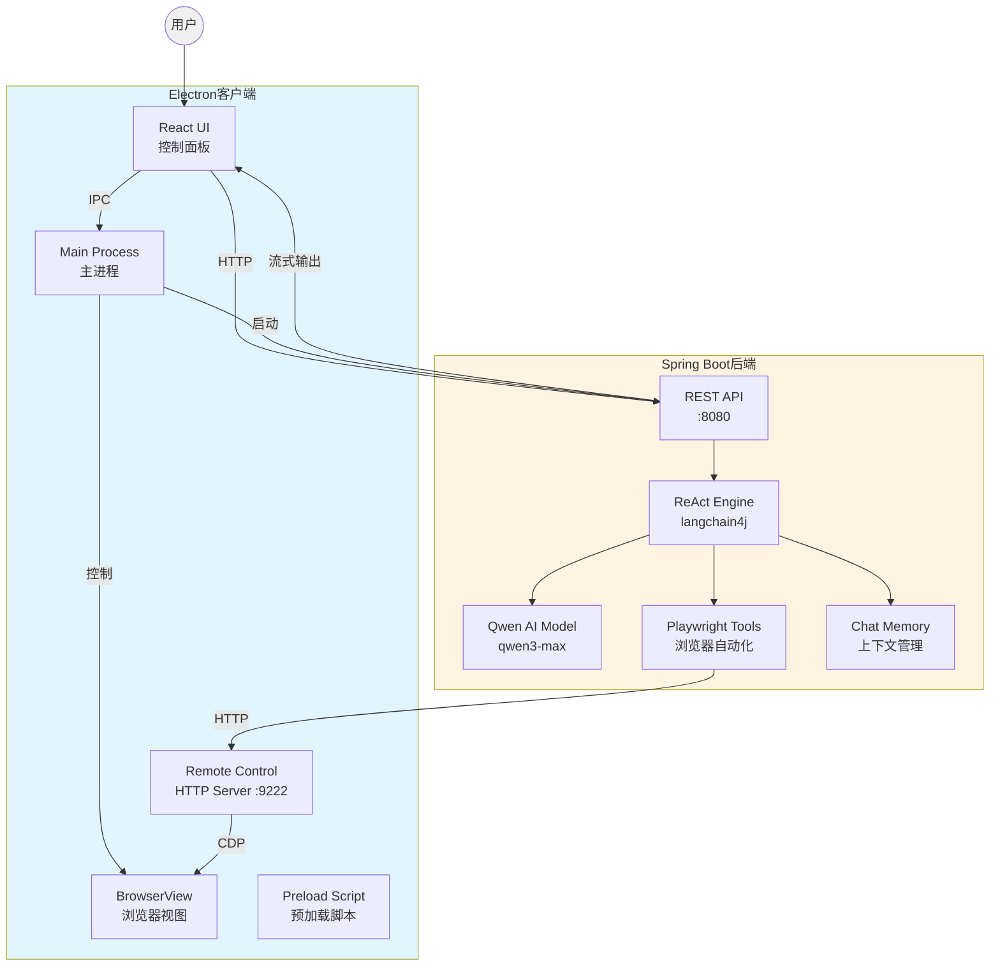
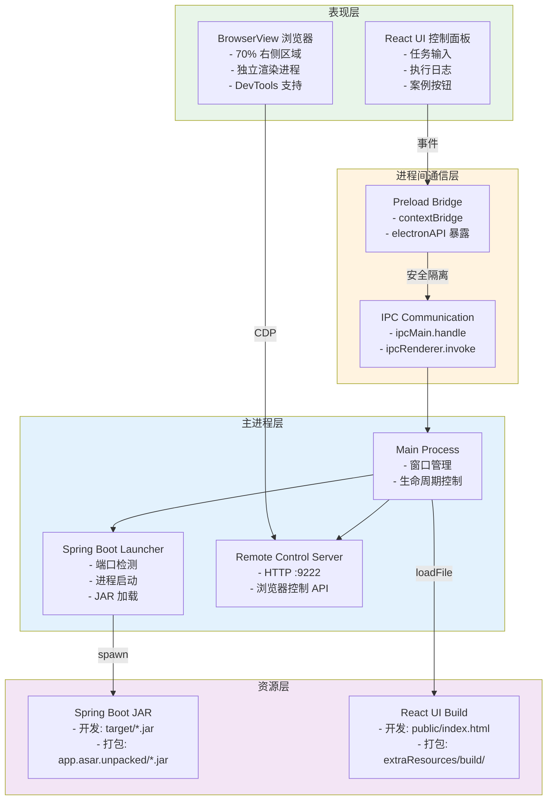
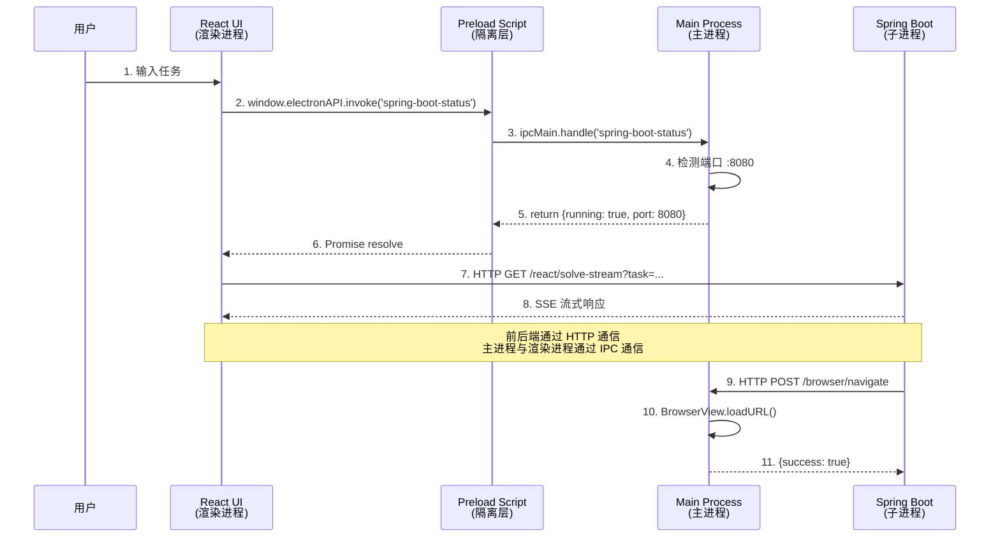
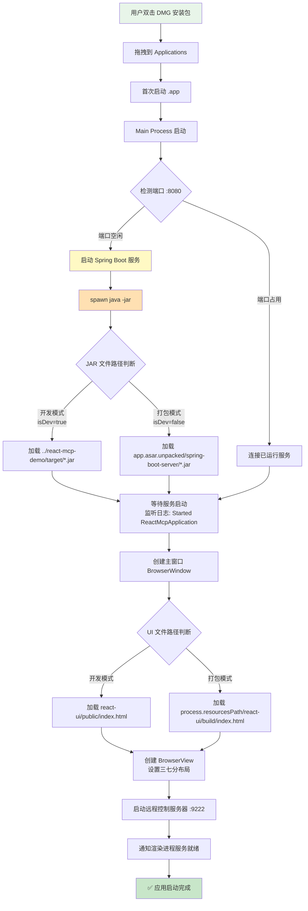

# ReAct MCP 智能代理客户端

基于 ReAct 框架的智能代理系统，集成 Playwright 浏览器自动化能力，采用 Electron + Spring Boot 一体化架构，为集团内部提供开箱即用的 AI 自动化工具。

## 🎯 项目定位

- **使用范围**：集团内部使用，服务各子公司
- **核心能力**：AI 驱动的浏览器自动化 + 智能决策
- **技术亮点**：ReAct 框架 + 上下文智能压缩 + 流式交互

## 📐 系统架构

### 整体架构图



### Electron 客户端分层架构



### IPC 通信流程



### Electron 安装与执行逻辑



### 打包后的文件结构

```
ReAct MCP 客户端.app/
├── Contents/
│   ├── MacOS/
│   │   └── ReAct MCP 客户端        # 可执行文件
│   ├── Resources/
│   │   ├── app.asar                # 主应用代码（压缩）
│   │   │   ├── main.js
│   │   │   ├── preload.js
│   │   │   └── node_modules/
│   │   ├── app.asar.unpacked/      # 不压缩的资源
│   │   │   └── spring-boot-server/
│   │   │       └── react-mcp-demo-0.0.1-SNAPSHOT.jar
│   │   └── react-ui/
│   │       └── build/
│   │           └── index.html       # React UI 构建文件
│   └── Info.plist
```

### 项目目录结构

```
MCP/
├── electron-react-mcp/              # Electron 客户端项目
│   ├── main.js                      # 主进程（窗口管理、服务启动）
│   ├── preload.js                   # 预加载脚本（IPC 桥接）
│   ├── package.json                 # 依赖配置 + 打包配置
│   ├── react-ui/                    # React UI 前端
│   │   ├── public/
│   │   │   └── index.html          # 主界面（开发模式）
│   │   └── build/                   # 构建产物（打包模式）
│   ├── spring-boot-server/          # Spring Boot JAR 存放
│   │   └── react-mcp-demo-0.0.1-SNAPSHOT.jar
│   └── dist/                        # 打包输出目录
│       └── ReAct MCP 客户端-1.0.0.dmg
│
└── react-mcp-demo/                  # Spring Boot 后端项目
    ├── src/main/java/
    │   └── com/example/reactmcp/
    │       ├── agent/               # ReAct Agent 接口
    │       │   └── McpAssistant.java
    │       ├── config/              # langchain4j 配置
    │       │   └── LangchainConfig.java
    │       ├── tools/               # Playwright MCP 工具
    │       │   └── PlaywrightMcpTools.java
    │       └── web/                 # REST API 控制器
    │           └── AgentController.java
    ├── src/main/resources/
    │   ├── application.yml          # 配置文件
    │   └── static/                  # 静态资源
    ├── pom.xml
    └── target/
        └── react-mcp-demo-0.0.1-SNAPSHOT.jar
```

## 🛠 技术栈

### 后端技术
- **Java 17** + **Spring Boot 3.5.8** - 企业级应用框架
- **langchain4j 0.36.2** - AI 编排框架
- **Qwen3-Max** - 通义千问大语言模型
- **ReAct 框架** - 推理与行动循环（Reasoning + Acting）
- **Playwright** - 浏览器自动化引擎
- **SSE (Server-Sent Events)** - 流式输出协议

### 前端技术
- **Electron 39.2.6** - 跨平台桌面应用框架
- **React (原生 JavaScript)** - UI 界面构建
- **BrowserView** - 嵌入式浏览器视图
- **IPC (进程间通信)** - 主进程与渲染进程通信
- **electron-builder** - 应用打包工具

### 核心依赖
```xml
<!-- langchain4j -->
<dependency>
    <groupId>dev.langchain4j</groupId>
    <artifactId>langchain4j</artifactId>
    <version>0.36.2</version>
</dependency>

<!-- Qwen 模型 -->
<dependency>
    <groupId>dev.langchain4j</groupId>
    <artifactId>langchain4j-dashscope</artifactId>
    <version>0.36.2</version>
</dependency>

<!-- Playwright -->
<dependency>
    <groupId>com.microsoft.playwright</groupId>
    <artifactId>playwright</artifactId>
    <version>1.49.0</version>
</dependency>
```

## ✨ 核心功能

### 1. 智能 ReAct 代理
- **思考-行动-观察循环**：AI 自主分解任务、选择工具、执行操作
- **实时流式输出**：完整展示 AI 决策过程和工具调用链
- **上下文智能管理**：
  - 消息窗口限制：10 条历史消息
  - 智能压缩算法：文本 5000 字符、HTML 8000 字符
  - 三段式采样：开头 40% + 中间 30% + 结尾 30%
  - 压缩率可达 90%+，大幅降低 Token 消耗

### 2. Playwright 浏览器自动化

#### 基础操作
- `navigate(url)` - 打开网页
- `click(selector)` - 点击元素
- `fill(selector, text)` - 填写输入框
- `screenshot(path)` - 页面截图
- `waitForElement(selector)` - 等待元素出现

#### 高级操作
- `getVisibleText()` - 获取可见文本（智能压缩）
- `getVisibleHtml(selector, cleanHtml)` - 获取 HTML（智能压缩）
- `analyzePage()` - 页面结构分析
- `hover(selector)` - 鼠标悬停
- `selectOption(selector, value)` - 下拉框选择
- `consoleLogs()` - 获取控制台日志

#### 远程浏览器模式
- 通过 HTTP API 控制 Electron 内嵌的 BrowserView
- 端口：9222
- 协议：自定义 REST API（非标准 CDP）

### 3. 一体化部署
- **开箱即用**：双击安装，无需配置环境
- **自动启动**：Electron 自动检测并启动 Spring Boot 服务
- **进程管理**：退出时自动清理后端进程
- **资源隔离**：JAR 文件在 `app.asar.unpacked` 中独立存放

### 4. 流式交互体验
- **SSE 长连接**：实时推送 AI 思考过程
- **分段展示**：思考 → 行动 → 结果逐步呈现
- **日志追踪**：完整记录工具调用参数和返回值

## 🚀 快速开始

### 方式一：使用安装包（推荐）

1. **下载安装包**
   ```bash
   # 从 dist 目录获取最新版本
   electron-react-mcp/dist/ReAct MCP 客户端-1.0.0.dmg
   ```

2. **安装**
   - 双击 DMG 文件
   - 拖拽到 Applications 文件夹
   - 右键选择「打开」（首次启动需要）

3. **使用**
   - 应用自动启动 Spring Boot 服务（首次需等待 3-5 秒）
   - 在左侧输入任务，点击「执行任务」
   - 右侧 BrowserView 实时展示浏览器操作

### 方式二：开发模式运行

#### 环境要求
- **Java 17+**
- **Node.js 14+**
- **Maven 3.6+**

#### 1. 编译后端
```bash
cd react-mcp-demo
mvn clean package -DskipTests
```

#### 2. 启动客户端
```bash
cd electron-react-mcp
npm install
npm start
```

> **注意**：开发模式下，Electron 会自动从 `react-mcp-demo/target/` 目录加载 JAR 文件并启动服务。

### 方式三：分离启动（调试模式）

#### 1. 手动启动后端
```bash
cd react-mcp-demo
java -jar target/react-mcp-demo-0.0.1-SNAPSHOT.jar
```

#### 2. 启动客户端
```bash
cd electron-react-mcp
npm start
```

> **说明**：此模式下 Electron 检测到 8080 端口已被占用，会直接连接现有服务。

## ⚙️ 配置说明

### Qwen API Key

在 `react-mcp-demo/src/main/resources/application.yml` 中配置：

```yaml
langchain4j:
  qwen:
    api-key: sk-your-api-key-here
    model-name: qwen3-max
    max-messages: 10  # 消息窗口大小
```

### 窗口布局

```javascript
// main.js 中的布局配置
const leftPanelWidth = Math.floor(totalWidth * 0.3);  // 左侧 30%
const browserViewWidth = totalWidth - leftPanelWidth;  // 右侧 70%
```

- **左侧控制面板**（30%）：
  - 任务输入框
  - 案例按钮
  - 执行日志
  - 服务状态指示

- **右侧 BrowserView**（70%）：
  - 独立浏览器视图
  - 自动 DevTools
  - 实时操作展示

### 远程浏览器控制

```javascript
// main.js 远程控制服务配置
const CONTROL_PORT = 9222;

// Spring Boot 通过以下 API 控制浏览器
POST http://localhost:9222/browser/navigate?url=...
POST http://localhost:9222/browser/click?selector=...
POST http://localhost:9222/browser/fill?selector=...&text=...
GET  http://localhost:9222/browser/getVisibleText
GET  http://localhost:9222/browser/screenshot?fullPage=true
```

## 🔌 API 接口

### Spring Boot 后端 API

#### 1. 执行任务（流式输出）
```http
GET http://localhost:8080/react/solve-stream?task={任务描述}
Content-Type: text/event-stream
```

**SSE 事件流格式**：
```
data: {"type":"thought","content":"我需要打开百度搜索..."}

data: {"type":"action","tool":"navigate","params":{"url":"https://www.baidu.com"}}

data: {"type":"observation","result":"页面加载成功"}

data: {"type":"final_answer","answer":"任务完成"}
```

#### 2. 检查服务状态
```http
GET http://localhost:8080/actuator/health
```

### Electron IPC 接口

#### 1. 获取 Spring Boot 状态
```javascript
// 渲染进程
const status = await window.electronAPI.invoke('spring-boot-status');
// 返回: {running: true, port: 8080}
```

#### 2. 获取服务信息
```javascript
const info = await window.electronAPI.invoke('get-service-info');
// 返回: {port: 8080, url: 'http://localhost:8080'}
```

### 远程浏览器控制 API

#### 1. 导航到 URL
```http
GET http://localhost:9222/browser/navigate?url=https://www.baidu.com
```

#### 2. 点击元素
```http
GET http://localhost:9222/browser/click?selector=#su
```

#### 3. 填写输入框
```http
GET http://localhost:9222/browser/fill?selector=#kw&text=人工智能
```

#### 4. 获取可见文本
```http
GET http://localhost:9222/browser/getVisibleText
```

#### 5. 获取 HTML
```http
GET http://localhost:9222/browser/getVisibleHtml?selector=body&cleanHtml=true
```

#### 6. 页面截图
```http
GET http://localhost:9222/browser/screenshot?fullPage=true
```

## 🎨 架构特点

### 1. 前后端分离设计
- **Spring Boot**：纯 API 服务，提供 ReAct 执行引擎
- **Electron**：UI 展示 + BrowserView 管理 + 服务启动
- **通信协议**：HTTP REST API + SSE 流式输出
- **解耦优势**：后端可独立部署、前端可独立更新

### 2. 智能上下文管理
- **分层防护策略**：
  - 工具层：智能压缩（文本 5000 / HTML 8000）
  - 消息层：窗口限制（max-messages=10）
  - 提示词层：约束工具自动调用
- **压缩算法**：三段式采样保留语义完整性
- **性能提升**：Token 消耗降低 90%+，推理速度提升 3-5x

### 3. 原生 BrowserView 架构
- **独立渲染进程**：不影响主 UI 性能
- **严格三七分布局**：左侧控制 30% + 右侧浏览 70%
- **自主浏览能力**：支持多标签、iframe、新窗口
- **远程控制接口**：通过 HTTP API 与后端通信

### 4. 一体化打包
- **ASAR 归档**：主应用代码压缩加载
- **资源解包**：JAR 文件在 `app.asar.unpacked` 中可执行
- **路径自适应**：自动判断开发/打包模式切换资源路径
- **进程管理**：应用退出时自动清理 Spring Boot 进程

### 5. 实时流式交互
- **完整思考链路**：捕获 AI 每一步推理过程
- **工具调用追踪**：记录参数、返回值、执行时间
- **SSE 长连接**：保持实时推送，无需轮询
- **前端解析**：逐行解析 `data:` 开头的事件流

## 🔧 开发指南

### 修改 UI 界面

```bash
# 直接编辑 HTML（无需编译后端）
vim electron-react-mcp/react-ui/public/index.html

# 重启客户端即可看到变化
cd electron-react-mcp
pkill -f electron
npm start
```

### 添加新工具

#### 1. 在后端定义工具

```java
// PlaywrightMcpTools.java
@Tool("工具描述")
public String yourNewTool(String param1, int param2) {
    // 实现逻辑
    return "结果";
}
```

#### 2. 重新编译

```bash
cd react-mcp-demo
mvn clean package -DskipTests
```

#### 3. 开发模式测试

```bash
# 重启客户端即可（自动加载最新 JAR）
cd electron-react-mcp
pkill -f "electron|java.*react-mcp"
npm start
```

#### 4. 打包发布

```bash
# 复制 JAR 到打包目录
cp react-mcp-demo/target/react-mcp-demo-0.0.1-SNAPSHOT.jar \
   electron-react-mcp/spring-boot-server/

# 生成安装包
cd electron-react-mcp
npm run dist
```

### 调整 AI 提示词

```java
// McpAssistant.java 或 LangchainConfig.java
String systemMessage = """
你是一个智能浏览器自动化助手...

### 可用工具
1. navigate(url) - 打开网页
2. click(selector) - 点击元素
...
""";
```

### 修改上下文压缩配置

```java
// PlaywrightMcpTools.java
private static final int MAX_TEXT_LENGTH = 5000;  // 调整文本压缩阈值
private static final int MAX_HTML_LENGTH = 8000;  // 调整 HTML 压缩阈值
```

```yaml
# application.yml
langchain4j:
  qwen:
    max-messages: 10  # 调整消息窗口大小
```

### 调试技巧

#### 1. 查看后端日志

```bash
# 客户端启动后，日志会实时输出到终端
[SPRING BOOT] 2025-12-12T14:14:47.100+08:00  INFO ...
```

#### 2. 查看前端控制台

```javascript
// 在 App.js 中添加调试日志
console.log('[DEBUG] Task:', taskInput);
console.log('[DEBUG] Response:', chunk);
```

#### 3. 测试 API 接口

```bash
# 直接测试后端 API
curl "http://localhost:8080/react/solve-stream?task=打开百度"

# 测试浏览器控制
curl "http://localhost:9222/browser/navigate?url=https://www.baidu.com"
```

### 常见问题

#### 1. 端口占用

```bash
# 检查端口占用
lsof -i :8080
lsof -i :9222

# 清理进程
pkill -f "java.*react-mcp"
```

#### 2. JAR 文件未更新

```bash
# 开发模式：确保编译成功
cd react-mcp-demo
mvn clean package -DskipTests

# 打包模式：确保复制到正确位置
cp target/*.jar ../electron-react-mcp/spring-boot-server/
```

#### 3. 打包后无法启动

```bash
# 检查 JAR 是否在 app.asar.unpacked 中
ls -la "dist/mac/ReAct MCP 客户端.app/Contents/Resources/app.asar.unpacked/spring-boot-server/"

# 查看打包日志
npm run dist 2>&1 | tee build.log
```

## 📄 许可证

**内部使用项目** - 仅供集团内部使用，未经授权不得外部分发。

---

## 🙏 致谢

- [langchain4j](https://github.com/langchain4j/langchain4j) - Java AI 编排框架
- [Playwright](https://playwright.dev/) - 浏览器自动化引擎
- [Electron](https://www.electronjs.org/) - 跨平台桌面应用框架
- [Qwen](https://tongyi.aliyun.com/) - 阿里云通义千问大模型

---

**版本**: 1.0.0  
**更新时间**: 2025-12-12  
**维护团队**: ReAct MCP Team
