# ReAct MCP 智能代理客户端

基于 ReAct 框架的智能代理系统,集成 Playwright 浏览器自动化能力,采用 **Electron + Node.js** 一体化架构,开箱即用的 AI 自动化工具。

> **技术架构**:Electron 桌面应用 + 嵌入式 Node.js 后端 + Qwen AI 模型


## 📐 系统架构

### 整体架构图

```mermaid
graph TB
    subgraph electron[Electron 主进程]
        Main[Main Process]
        UI[React UI 控制面板]
        BV[BrowserView 浏览器]
        Preload[Preload Script]
        Remote[Playwright 控制服务 9222]
        Backend[Node.js 后端 8080]
        ReAct[ReAct Agent]
        Qwen[Qwen AI]
        Tools[Tool Registry]
    end
    User((用户)) --> UI
    UI --> Main
    UI --> Backend
    Main --> BV
    Backend --> ReAct
    ReAct --> Qwen
    ReAct --> Tools
    Tools --> Remote
    Remote --> BV
```



### Electron 客户端分层架构

```mermaid
graph TD
    subgraph Main[主进程]
        A[Main Process]
        B[Node.js 后端 8080]
        C[Playwright 控制 9222]
    end
    subgraph UI[渲染进程]
        D[React UI 控制面板]
        E[BrowserView 浏览器]
    end
    A --> B
    A --> C
    A --> D
    A --> E
    D --> B
    C --> E
```



### IPC 通信流程

```mermaid
sequenceDiagram
    participant User as 用户
    participant UI as React UI
    participant Main as Main Process
    participant Backend as Node.js Backend
    participant BV as BrowserView
    User->>UI: 1. 输入任务
    UI->>Backend: 2. HTTP /react/solve-stream
    Backend->>Backend: 3. ReAct 推理循环
    Backend->>Main: 4. HTTP /browser/navigate
    Main->>BV: 5. Playwright 操作
    BV-->>Main: 6. 操作结果
    Main-->>Backend: 7. 返回结果
    Backend-->>UI: 8. SSE 流式响应
```



### Electron 安装与执行逻辑

```mermaid
graph TD
    A[用户双击 DMG 安装包] --> B[拖拽到 Applications]
    B --> C[首次启动 .app]
    C --> D[Main Process 启动]
    D --> E[动态 import 后端模块]
    E --> F{Node.js 文件路径判断}
    F -->|开发模式| G[加载 node-backend/src/server.js]
    F -->|打包模式| H[加载 app.asar.unpacked]
    G --> I[调用 startServer 启动服务]
    H --> I
    I --> L[后端服务就绪]
    L --> M[创建主窗口 BrowserWindow]
    M --> N{UI 文件路径判断}
    N -->|开发模式| O[加载 react-ui/public/index.html]
    N -->|打包模式| P[加载 resourcesPath/react-ui/build]
    O --> Q[创建 BrowserView]
    P --> Q
    Q --> R[启动远程控制服务器 9222]
    R --> S[通知渲染进程服务就绪]
    S --> T[应用启动完成]
```



### 打包后的文件结构

```
ReAct MCP 客户端.app/
├── Contents/
│   ├── MacOS/
│   │   └── ReAct MCP 客户端        # 可执行文件
│   ├── Resources/
│   │   ├── app.asar                # 主应用代码（压缩）
│   │   │   ├── main.js
│   │   │   ├── preload.js
│   │   │   └── node_modules/
│   │   ├── app.asar.unpacked/      # 不压缩的资源
│   │   │   └── node-backend/
│   │   │       ├── src/
│   │   │       │   └── server.js   # Node.js 后端入口
│   │   │       └── node_modules/
│   │   └── react-ui/
│   │       └── build/
│   │           └── index.html       # React UI 构建文件
│   └── Info.plist
```

### 项目目录结构

```
MCP/
├── electron-react-mcp/              # Electron 客户端项目（一体化工程）
│   ├── main.js                      # 主进程（窗口管理、后端启动）
│   ├── preload.js                   # 预加载脚本（IPC 桥接）
│   ├── package.json                 # 依赖配置 + 打包配置
│   ├── node-backend/                # Node.js 后端（内嵌）
│   │   ├── src/
│   │   │   ├── server.js            # 后端入口
│   │   │   ├── agent/
│   │   │   │   └── reactAgent.js    # ReAct Agent 实现
│   │   │   ├── tools/
│   │   │   │   ├── toolRegistry.js  # 工具注册中心
│   │   │   │   └── playwrightTools.js # 浏览器工具
│   │   │   └── config/
│   │   │       └── llmConfig.js     # LLM 配置
│   │   └── package.json
│   ├── react-ui/                    # React UI 前端
│   │   ├── public/
│   │   │   └── index.html          # 主界面（开发模式）
│   │   └── build/                   # 构建产物（打包模式）
│   └── dist/                        # 打包输出目录
│       └── ReAct MCP 客户端-1.0.0.dmg
├── build-package.sh                 # 打包脚本
└── start-frontend.sh                # 开发启动脚本
```

## 🛠 技术栈

### 后端技术
- **Node.js 18+** - JavaScript 运行时环境
- **Express 4.x** - Web 应用框架
- **OpenAI SDK** - AI 模型集成（兼容 Qwen）
- **ReAct 框架** - 自定义实现（推理与行动循环）
- **Playwright** - 浏览器自动化引擎
- **SSE (Server-Sent Events)** - 流式输出协议

### 前端技术
- **Electron 39.2.6** - 跨平台桌面应用框架
- **React (原生 JavaScript)** - UI 界面构建
- **BrowserView** - 嵌入式浏览器视图
- **IPC (进程间通信)** - 主进程与渲染进程通信
- **electron-builder** - 应用打包工具

### 核心依赖
```json
{
  "dependencies": {
    "express": "^4.18.0",
    "openai": "^4.0.0",
    "playwright": "^1.40.0",
    "dotenv": "^16.0.0"
  }
}
```

## ✨ 核心功能

### 1. 智能 ReAct 代理
- **思考-行动-观察循环**：AI 自主分解任务、选择工具、执行操作
- **实时流式输出**：完整展示 AI 决策过程和工具调用链
- **上下文智能管理**：
  - 消息窗口限制：10 条历史消息
  - 智能压缩算法：文本 5000 字符、HTML 8000 字符
  - 三段式采样：开头 40% + 中间 30% + 结尾 30%
  - 压缩率可达 90%+，大幅降低 Token 消耗

### 2. Playwright 浏览器自动化

#### 基础操作
- `navigate(url)` - 打开网页
- `click(selector)` - 点击元素
- `fill(selector, text)` - 填写输入框
- `screenshot(path)` - 页面截图
- `waitForElement(selector)` - 等待元素出现

#### 高级操作
- `getVisibleText()` - 获取可见文本（智能压缩）
- `getVisibleHtml(selector, cleanHtml)` - 获取 HTML（智能压缩）
- `analyzePage()` - 页面结构分析
- `hover(selector)` - 鼠标悬停
- `selectOption(selector, value)` - 下拉框选择
- `consoleLogs()` - 获取控制台日志

#### 远程浏览器模式
- 通过 HTTP API 控制 Electron 内嵌的 BrowserView
- 端口：9222
- 协议：自定义 REST API（非标准 CDP）

### 3. 一体化部署
- **开箱即用**：双击安装，无需配置环境
- **自动启动**：Electron 自动检测并启动 Node.js 后端服务
- **进程管理**：退出时自动清理后端进程
- **资源隔离**：Node.js 后端在 `app.asar.unpacked` 中独立存放

### 4. 流式交互体验
- **SSE 长连接**：实时推送 AI 思考过程
- **分段展示**：思考 → 行动 → 结果逐步呈现
- **日志追踪**：完整记录工具调用参数和返回值

## 🚀 快速开始

### 🎯 推荐方式：使用一键脚本

项目提供了三个便捷脚本，简化开发和打包流程：

#### 1. 安装包打包脚本 `build-package.sh`

**完整流程**(编译 React UI + 打包客户端):
```bash
# 交互式打包（菜单选择平台）
./build-package.sh

# 命令行打包（适合 CI/CD）
./build-package.sh --mac      # 仅打包 macOS
./build-package.sh --win      # 仅打包 Windows
./build-package.sh --all      # 打包所有平台
./build-package.sh --auto     # 自动打包当前平台（非交互）
./build-package.sh --prepare  # 仅准备后端（不打包）
```

**功能说明**:
- ✅ 复制 Node.js 后端到打包目录
- ✅ 安装客户端依赖（如需要）
- ✅ 支持交互式和命令行两种模式
- ✅ 打包生成安装包(DMG/EXE/AppImage)
- ✅ 显示打包产物位置和大小
- ✅ 适配多平台和 CI/CD 环境

#### 2. 客户端启动脚本 `start-frontend.sh`

**开发模式启动**(推荐,支持热重载):
```bash
./start-frontend.sh
```

**生产模式启动**(先编译再启动):
```bash
./start-frontend.sh --build
```

**功能说明**:
- ✅ 自动检查并安装依赖
- ✅ 检测端口占用情况
- ✅ 启动 Electron 客户端
- ✅ 自动启动内嵌 Node.js 后端服务

---

### 方式一：使用安装包（终端用户）

1. **下载安装包**
   ```bash
   # 从 dist 目录获取最新版本
   electron-react-mcp/dist/ReAct MCP 客户端-1.0.0.dmg
   ```

2. **安装**
   - 双击 DMG 文件
   - 拖拽到 Applications 文件夹
   - 右键选择「打开」（首次启动需要）

3. **使用**
   - 应用自动启动 Node.js 后端服务(首次需等待 1-2 秒)
   - 在左侧输入任务,点击「执行任务」
   - 右侧 BrowserView 实时展示浏览器操作

### 方式二：开发模式运行（推荐开发者）

#### 环境要求
- **Node.js 18+**
- **npm 8+**

#### 快速启动（推荐）
```bash
# 使用一键脚本
./start-frontend.sh
```

#### 手动启动

```bash
cd electron-react-mcp
npm install
npm start
```

> **注意**：Electron 启动时会自动加载内嵌的 Node.js 后端服务，无需单独启动。

## ⚙️ 配置说明

### 🔐 安全配置：API Key 管理

**强烈推荐使用环境变量管理敏感信息，避免将 API Key 提交到代码仓库！**

#### 步骤 1：创建本地环境变量文件

```bash
# 复制环境变量模板
cd electron-react-mcp/node-backend
cp .env.example .env

# 编辑 .env 文件，填写真实的 API Key
vim .env
```

`.env` 文件示例：
```bash
# Qwen 配置
QWEN_API_KEY=sk-your-real-qwen-api-key-here

# OpenAI 配置
OPENAI_BASE_URL=https://api.openai.com/v1
OPENAI_API_KEY=sk-proj-xxx-your-real-key-xxx
OPENAI_MODEL_NAME=gpt-4o-mini
```

**注意：** `.env` 文件已在 `.gitignore` 中配置忽略，不会被提交到 Git！

#### 步骤 2：启动项目

项目会自动加载 `.env` 文件中的环境变量:

```bash
./start-frontend.sh
```

---

### 多 LLM 提供商支持

项目支持多种 LLM 提供商，可通过环境变量配置：

#### 支持的提供商
- **Qwen**（阿里云 DashScope）- 默认
- **OpenAI** 官方 API
- **私有化 OpenAI 协议服务**（vLLM, Ollama, 内部网关等）

#### 配置示例

**使用 Qwen（默认）：**
```bash
# .env 文件
LLM_PROVIDER=qwen
QWEN_API_KEY=sk-your-qwen-api-key-here
QWEN_MODEL=qwen-turbo
```

**切换到 OpenAI：**
```bash
# .env 文件
LLM_PROVIDER=openai
OPENAI_API_KEY=sk-your-openai-key
OPENAI_BASE_URL=https://api.openai.com/v1
OPENAI_MODEL=gpt-4o-mini
```

**使用私有化服务：**
```bash
# .env 文件
LLM_PROVIDER=openai
OPENAI_API_KEY=sk-your-private-key
OPENAI_BASE_URL=http://your-gateway.com/v1
OPENAI_MODEL=your-model-name
```

📚 **详细配置指南**：请查看 [LLM_PROVIDER_GUIDE.md](./LLM_PROVIDER_GUIDE.md)

---

### 后端服务配置

配置文件位于 `electron-react-mcp/node-backend/src/config/llmConfig.js`：

```javascript
// LLM 配置
const llmConfig = {
  provider: process.env.LLM_PROVIDER || 'qwen',
  qwen: {
    apiKey: process.env.QWEN_API_KEY,
    model: process.env.QWEN_MODEL || 'qwen-turbo',
    baseURL: 'https://dashscope.aliyuncs.com/compatible-mode/v1'
  },
  openai: {
    apiKey: process.env.OPENAI_API_KEY,
    model: process.env.OPENAI_MODEL || 'gpt-4o-mini',
    baseURL: process.env.OPENAI_BASE_URL || 'https://api.openai.com/v1'
  },
  maxMessages: 10  // 消息窗口大小
};
```

### 窗口布局

```javascript
// main.js 中的布局配置
const leftPanelWidth = Math.floor(totalWidth * 0.3);  // 左侧 30%
const browserViewWidth = totalWidth - leftPanelWidth;  // 右侧 70%
```

- **左侧控制面板**（30%）：
  - 任务输入框
  - 案例按钮
  - 执行日志
  - 服务状态指示

- **右侧 BrowserView**（70%）：
  - 独立浏览器视图
  - 自动 DevTools
  - 实时操作展示

### 远程浏览器控制

```javascript
// main.js 远程控制服务配置
const CONTROL_PORT = 9222;

// Node.js 后端通过以下 API 控制浏览器
POST http://localhost:9222/browser/navigate?url=...
POST http://localhost:9222/browser/click?selector=...
POST http://localhost:9222/browser/fill?selector=...&text=...
GET  http://localhost:9222/browser/getVisibleText
GET  http://localhost:9222/browser/screenshot?fullPage=true
```

## 🔌 API 接口

### Node.js 后端 API

#### 1. 执行任务（流式输出）
```http
GET http://localhost:8080/react/solve-stream?task={任务描述}
Content-Type: text/event-stream
```

**SSE 事件流格式**：
```
data: {"type":"thought","content":"我需要打开百度搜索..."}

data: {"type":"action","tool":"navigate","params":{"url":"https://www.baidu.com"}}

data: {"type":"observation","result":"页面加载成功"}

data: {"type":"final_answer","answer":"任务完成"}
```

#### 2. 检查服务状态
```http
GET http://localhost:8080/actuator/health
```

### Electron IPC 接口

#### 1. 获取服务信息
```javascript
const info = await window.electronAPI.invoke('get-service-info');
// 返回: {port: 8080, url: 'http://localhost:8080'}
```

### 远程浏览器控制 API

#### 1. 导航到 URL
```http
GET http://localhost:9222/browser/navigate?url=https://www.baidu.com
```
**返回**: `{ success: true, message: 'Navigation started', url: '...' }`

#### 2. 点击元素
```http
GET http://localhost:9222/browser/click?selector=#su
```
**参数**: `selector` - CSS 选择器  
**返回**: `{ success: true, message: 'Click executed successfully' }`

#### 3. 填写输入框
```http
GET http://localhost:9222/browser/fill?selector=#kw&text=人工智能
```
**参数**: 
- `selector` - CSS 选择器
- `text` - 要填充的文本  

**返回**: `{ success: true, message: 'Fill executed successfully' }`

#### 4. 按键操作
```http
GET http://localhost:9222/browser/press?key=Enter
```
**参数**: `key` - 键盘按键名（如 Enter、Tab、Escape 等）  
**返回**: `{ success: true, message: 'Pressed key: Enter' }`

#### 5. 获取页面 URL
```http
GET http://localhost:9222/browser/getPageUrl
```
**返回**: `{ success: true, url: 'https://...' }`

#### 6. 获取页面标题
```http
GET http://localhost:9222/browser/getPageTitle
```
**返回**: `{ success: true, title: '...' }`

#### 7. 获取页面信息
```http
GET http://localhost:9222/browser/getPageInfo
```
**返回**: `{ success: true, result: { url: '...', title: '...' } }`

#### 8. 获取可见文本
```http
GET http://localhost:9222/browser/getVisibleText?selector=body
```
**参数**: `selector` - CSS 选择器（可选，默认 body）  
**返回**: `{ success: true, result: '页面可见文本内容...' }`

#### 9. 获取 HTML
```http
GET http://localhost:9222/browser/getVisibleHtml?selector=body&cleanHtml=true
```
**参数**: 
- `selector` - CSS 选择器（可选，默认 html）
- `cleanHtml` - 是否清理 script/style 标签（true/false）  

**返回**: `{ success: true, result: '<html>...</html>' }`

#### 10. 执行 JavaScript
```http
POST http://localhost:9222/browser/executeJs
Content-Type: application/json

{"script": "document.querySelector('#kw').value"}
```
**Body**: `{ script: '要执行的 JavaScript 代码' }`  
**返回**: `{ success: true, result: '执行结果' }`

#### 11. 页面分析
```http
GET http://localhost:9222/browser/analyzePage
```
**返回**: 完整的页面结构分析，包括：
- 页面基本信息（URL、标题、时间戳）
- Meta 标签
- 标题结构（h1-h6）
- 表单信息
- 链接列表
- 图片信息
- 输入框和按钮
- 表格和列表
- 脚本和样式表
- 性能指标

#### 12. 获取控制台日志
```http
GET http://localhost:9222/browser/consoleLogs?type=all&limit=50
```
**参数**: 
- `type` - 日志类型（可选，默认 all）
- `limit` - 日志数量限制（可选，默认 50）  

**返回**: `{ success: true, result: [{ type: 'log', message: '...', timestamp: '...' }] }`

#### 13. 页面截图
```http
GET http://localhost:9222/browser/screenshot?fullPage=true
```
**参数**: 
- `fullPage` - 是否截取完整页面（true/false）
- `selector` - 截取特定元素（可选）  

**返回**: `{ success: true, result: 'base64编码的PNG图片...' }`

#### 14. 调试：获取输入框信息
```http
GET http://localhost:9222/browser/debug/inputs
```
**返回**: 页面所有输入框的详细信息（标签、类型、名称、ID、类名、占位符、可见性等）

## 🎨 架构特点

### 1. 前后端分离设计
- **Node.js 后端**:纯 API 服务,提供 ReAct 执行引擎
- **Electron**:UI 展示 + BrowserView 管理 + 服务启动
- **通信协议**:HTTP REST API + SSE 流式输出
- **解耦优势**:后端可独立部署、前端可独立更新

### 2. 智能上下文管理
- **分层防护策略**：
  - 工具层：智能压缩（文本 5000 / HTML 8000）
  - 消息层：窗口限制（max-messages=10）
  - 提示词层：约束工具自动调用
- **压缩算法**：三段式采样保留语义完整性
- **性能提升**：Token 消耗降低 90%+，推理速度提升 3-5x

### 3. 原生 BrowserView 架构
- **独立渲染进程**：不影响主 UI 性能
- **严格三七分布局**：左侧控制 30% + 右侧浏览 70%
- **自主浏览能力**：支持多标签、iframe、新窗口
- **远程控制接口**：通过 HTTP API 与后端通信

### 4. 一体化打包
- **ASAR 归档**:主应用代码压缩加载
- **资源解包**:Node.js 后端在 `app.asar.unpacked` 中可执行
- **路径自适应**:自动判断开发/打包模式切换资源路径
- **进程管理**:应用退出时自动清理 Node.js 进程

### 5. 实时流式交互
- **完整思考链路**：捕获 AI 每一步推理过程
- **工具调用追踪**：记录参数、返回值、执行时间
- **SSE 长连接**：保持实时推送，无需轮询
- **前端解析**：逐行解析 `data:` 开头的事件流

## 🔧 开发指南

### 修改 UI 界面

```bash
# 直接编辑 HTML（无需编译后端）
vim electron-react-mcp/react-ui/public/index.html

# 重启客户端即可看到变化
cd electron-react-mcp
pkill -f electron
npm start
```

### 添加新工具

#### 1. 在后端定义工具

```javascript
// tools/yourNewTools.js
class YourNewTools {
  constructor() {
    this.name = 'yourNewTool';
    this.description = '工具描述';
  }

  async execute(param1, param2) {
    // 实现逻辑
    return '结果';
  }
  
  getSchema() {
    return {
      type: 'function',
      function: {
        name: this.name,
        description: this.description,
        parameters: {
          type: 'object',
          properties: {
            param1: { type: 'string', description: '参数1' },
            param2: { type: 'number', description: '参数2' }
          },
          required: ['param1']
        }
      }
    };
  }
}
```

#### 2. 注册工具

```javascript
// tools/toolRegistry.js
const YourNewTools = require('./yourNewTools');

class ToolRegistry {
  constructor() {
    this.tools = new Map();
    this.registerTool(new YourNewTools());
  }
  // ...
}
```

#### 3. 开发模式测试

```bash
# 重启客户端即可（自动加载最新代码）
cd electron-react-mcp
pkill -f "electron|node.*server.js"
npm start
```

#### 4. 打包发布

```bash
# 使用一键打包脚本
./build-package.sh --mac

# 或手动打包
cd electron-react-mcp
npm run dist:mac
```

### 调整 AI 提示词

```javascript
// agent/reactAgent.js
buildSystemPrompt() {
  return `你是一个基于 ReAct 框架的智能 Agent...
  
  ## 可用工具
  1. navigate(url) - 打开网页
  2. click(selector) - 点击元素
  ...`;
}
```

### 修改上下文管理配置

```javascript
// config/llmConfig.js
const llmConfig = {
  maxMessages: 15,  // 调整消息窗口大小
  // ...
};
```

### 调试技巧

#### 1. 查看后端日志

```bash
# 客户端启动后，日志会实时输出到终端
[NODE.JS BACKEND] 服务器已启动
[NODE.JS BACKEND] 端口: 8080
```

#### 2. 查看前端控制台

```javascript
// 在 App.js 中添加调试日志
console.log('[DEBUG] Task:', taskInput);
console.log('[DEBUG] Response:', chunk);
```

#### 3. 测试 API 接口

```bash
# 直接测试后端 API
curl "http://localhost:8080/react/solve-stream?task=打开百度"

# 测试浏览器控制
curl "http://localhost:9222/browser/navigate?url=https://www.baidu.com"

# 检查健康状态
curl "http://localhost:8080/health"
```

### 常见问题

#### 1. 端口占用

```bash
# 检查端口占用
lsof -i :8080
lsof -i :9222

# 清理进程
pkill -f "node.*server.js"
pkill -f "electron"
```

#### 2. 后端代码未更新

```bash
# 确保依赖安装成功
cd electron-react-mcp/node-backend
npm install
```

#### 3. 打包后无法启动

```bash
# 检查 Node.js 后端是否在 app.asar.unpacked 中
ls -la "dist/mac/ReAct MCP 客户端.app/Contents/Resources/app.asar.unpacked/node-backend/"

# 查看打包日志
cd electron-react-mcp
npm run dist 2>&1 | tee build.log
```

## 📄 许可证

**内部使用项目** - 仅供集团内部使用，未经授权不得外部分发。

---

## 🙏 致谢

- [OpenAI](https://openai.com/) - AI 模型 API
- [Playwright](https://playwright.dev/) - 浏览器自动化引擎
- [Electron](https://www.electronjs.org/) - 跨平台桌面应用框架
- [Qwen](https://tongyi.aliyun.com/) - 阿里云通义千问大模型
- [Express](https://expressjs.com/) - Node.js Web 框架

---

**版本**: 2.0.0 (Node.js Backend)  
**更新时间**: 2025-12-16  
**技术架构**: Electron + Node.js + ReAct + Playwright
