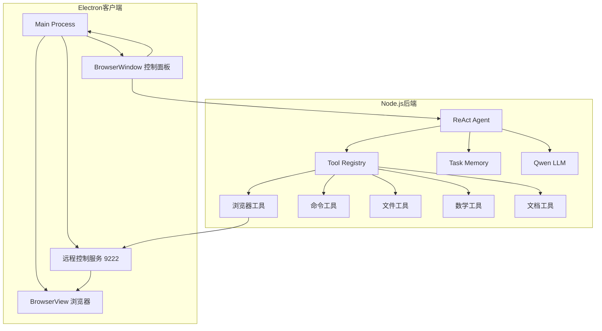

# ReAct MCP 桌面客户端

> 基于 Electron + Node.js 的智能 ReAct 代理系统，支持浏览器自动化、命令执行、文件操作等 20+ 工具

## 🌟 核心特性

- ⚡ **一体化桌面应用** - 无需分别启动前后端服务
- 🤖 **ReAct 智能代理** - 自动推理、行动、观察循环
- 🌐 **浏览器自动化** - 内置 Playwright 工具集
- 💻 **智能脚本生成** - 自动生成并执行 shell/python/node 脚本
- 📦 **跨平台支持** - macOS、Windows 一键打包
- 🧠 **任务记忆系统** - 学习历史任务经验

## 🚀 快速开始

### 环境要求

- Node.js 14+
- npm 6+
- Qwen API Key (通义千问)

### 开发模式运行

```bash
# 1. 安装依赖
npm install

# 2. 配置 API Key
export DASHSCOPE_API_KEY=your_api_key_here

# 3. 启动应用
npm start
```

启动后会自动：
- 启动 Node.js 后端（端口 8080）
- 开启远程调试端口（9222）
- 加载 Electron 客户端界面

## 📦 打包成可执行文件

### 一键打包（推荐）

```bash
./scripts/package-all.sh
```

根据提示选择平台：
- [1] Mac (dmg)
- [2] Windows (exe + zip)
- [3] 所有平台
- [4] 仅准备（不打包）

### 分步打包

```bash
# 步骤 1: 准备后端
npm run build:electron

# 步骤 2: 选择平台打包
npm run dist:mac      # macOS 安装包
npm run dist:win      # Windows 安装包
npm run dist:all      # 所有平台
```

### 打包输出

打包完成后，安装包位于 `dist/` 目录：

```
dist/
├── ReAct MCP 客户端-1.0.0.dmg          # macOS 安装包
├── ReAct MCP 客户端-1.0.0.exe          # Windows 安装程序  
├── ReAct MCP 客户端-1.0.0-win.zip      # Windows 绿色版
└── mac/ReAct MCP 客户端.app            # macOS 应用程序
```

### 安装包架构

```
ReAct MCP 客户端.app/
├── Contents/
│   ├── MacOS/
│   │   └── ReAct MCP 客户端          # Electron 主进程
│   └── Resources/
│       ├── app.asar                  # 客户端代码（压缩）
│       ├── app.asar.unpacked/
│       │   └── node-backend/         # Node.js 后端
│       │       ├── src/
│       │       ├── node_modules/
│       │       └── data/             # 任务记忆
│       └── react-ui/
│           └── build/index.html      # 前端界面
```

### 运行要求

安装包需要配置环境变量：

```bash
# macOS/Linux
export DASHSCOPE_API_KEY=your_api_key_here

# Windows
set DASHSCOPE_API_KEY=your_api_key_here

# 或者在 PowerShell
$env:DASHSCOPE_API_KEY="your_api_key_here"
```

### 常见问题

**Q: 打包失败，找不到 node-backend？**  
A: 先运行 `npm run build:electron` 准备后端

**Q: 打包后运行报错？**  
A: 检查是否配置了 `DASHSCOPE_API_KEY` 环境变量

**Q: Windows 下打包 macOS 版本？**  
A: 需要在 macOS 上打包，或使用 GitHub Actions

## 📁 项目结构

```
electron-react-mcp/
├── main.js                 # Electron 主进程
├── preload.js              # 预加载脚本
├── package.json           # Electron 项目配置
├── react-ui/             # React 前端
│   └── public/           # 静态资源（index.html）
├── node-backend/         # Node.js 后端（打包时生成）
│   ├── src/              # 后端源码
│   ├── node_modules/     # 后端依赖
│   └── package.json      # 后端配置
├── scripts/              # 构建和启动脚本
│   ├── build-electron.js # 构建脚本
│   └── package-all.sh    # 一键打包脚本
└── dist/                # 构建输出目录
```

## 🏗️ 系统架构



### 工作流程

1. **用户输入任务** → 前端控制面板
2. **ReAct 循环**：
   - **Thought**: LLM 分析任务，决定下一步
   - **Action**: 调用工具（浏览器/命令/文件等）
   - **Observation**: 观察工具执行结果
3. **任务记忆** → 自动保存复杂任务经验
4. **流式输出** → SSE 实时显示执行过程

## 🛠️ 可用工具

### 浏览器自动化（16个）

#### 基础导航
- `navigate(url)` - 导航到指定网址
- `goBack()` - 浏览器后退
- `goForward()` - 浏览器前进
- `reload()` - 刷新页面

#### 元素交互
- `click(selector)` - 点击元素
- `fill(selector, value)` - 填充表单字段（支持敏感词过滤）
- `press(key)` - 按下键盘按键
- `hover(selector)` - 鼠标悬停
- `select(selector, value)` - 下拉框选择
- `waitForSelector(selector, timeout)` - 等待元素出现

#### 信息获取
- `screenshot(fileName)` - 页面截图
- `getPageContent()` - 获取页面可见文本（智能压缩）
- `getPageUrl()` - 获取当前URL
- `getPageTitle()` - 获取页面标题
- `getConsoleLogs()` - 获取控制台日志

> **注意**: 所有工具通过 HTTP :9222 远程控制 Electron 内嵌的 BrowserView

### 命令执行（2个）
- `executeCommand(command)` - 执行简单命令（ls、ps、curl等）
- `executeScript(code, language)` - 执行脚本（shell/bash/python/node）

### 文件操作（5个）
- `readFile(path)` - 读取文件
- `writeFile(path, content)` - 写入文件
- `listDirectory(path)` - 列出目录
- `deleteFile(path)` - 删除文件
- `createDirectory(path)` - 创建目录

### 文档读取（2个）
- `readWordDocument(path)` - 读取 Word 文档
- `readExcelDocument(path)` - 读取 Excel 表格

### 数学计算（5个）
- `add(a, b)` - 加法
- `subtract(a, b)` - 减法
- `multiply(a, b)` - 乘法
- `divide(a, b)` - 除法
- `squareRoot(n)` - 平方根

## 🔧 开发指南

### 添加新工具

1. 在 `node-backend/src/tools/` 创建工具文件
2. 定义 `getToolDefinitions()` 和 `executeTool()` 方法
3. 在 `toolRegistry.js` 中注册
4. 重启服务生效（无需重新打包）

**示例**：
```javascript
export class MyTools {
  static getToolDefinitions() {
    return [{
      type: 'function',
      function: {
        name: 'myTool',
        description: '工具描述',
        parameters: { /* ... */ }
      }
    }];
  }
  
  static async executeTool(toolName, args) {
    // 实现逻辑
  }
}
```

### 调试技巧

- 🔍 **查看日志**: 终端输出显示完整执行过程
- 🛠️ **DevTools**: BrowserView 自动打开开发者工具
- 📝 **任务记忆**: 查看 `node-backend/data/task-memory.json`
- 🔄 **热重载**: 修改代码后重启即可（`npm start`）

### 修改 AI 提示词

编辑 `node-backend/src/agent/reactAgent.js`：

```javascript
buildSystemPrompt() {
  return `
你是一个智能 ReAct 代理...
// 在这里修改系统提示词
  `;
}
```

### 调整工具集合

编辑 `node-backend/src/tools/playwrightTools.js`：
```javascript
static getToolDefinitions() {
  return [
    // 只返回需要的工具定义
  ];
}
```

## 🤝 贡献

欢迎提交 Issue 和 Pull Request 来改进这个项目！

## 📄 许可证

MIT