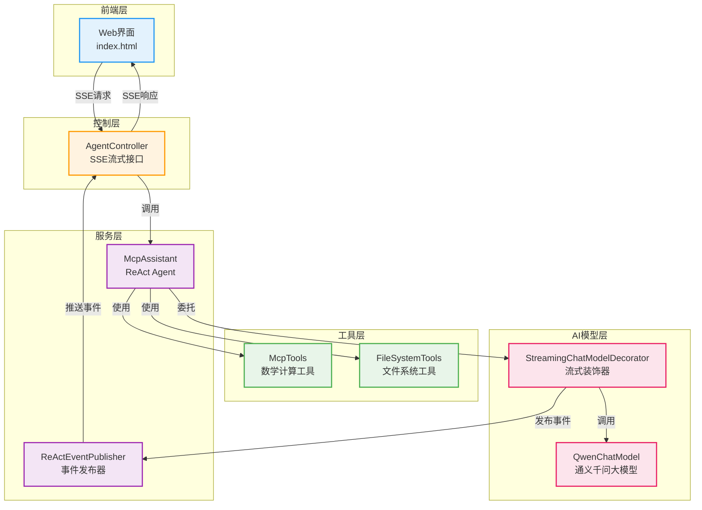

# 文件系统 MCP 工具集成文档

## 概述

本项目已成功集成本地文件系统操作能力，基于 MCP (Model Context Protocol) 协议实现。AI 助手现在可以安全地执行文件读写、目录管理等操作。

## 技术架构



## 已实现的文件系统工具

### 1. 文件读写操作

#### readFile
- **功能**: 读取指定文件的完整内容
- **参数**: `filePath` - 文件相对路径
- **返回**: 文件文本内容
- **示例**: `readFile("Documents/readme.txt")`

#### writeFile
- **功能**: 写入内容到文件，不存在则创建，存在则覆盖
- **参数**: 
  - `filePath` - 文件相对路径
  - `content` - 文件内容
- **返回**: 操作结果消息
- **示例**: `writeFile("Documents/test.txt", "Hello World")`

### 2. 目录操作

#### listFiles
- **功能**: 列出目录下的文件和子目录
- **参数**: 
  - `directoryPath` - 目录相对路径
  - `recursive` - 是否递归列出（true/false）
- **返回**: 格式化的目录树结构
- **示例**: `listFiles("Documents", false)`

#### createDirectory
- **功能**: 创建新目录，支持创建父目录
- **参数**: `directoryPath` - 目录相对路径
- **返回**: 操作结果消息
- **示例**: `createDirectory("Documents/NewFolder")`

### 3. 文件管理操作

#### deleteFile
- **功能**: 删除指定文件
- **参数**: `filePath` - 文件相对路径
- **返回**: 操作结果消息
- **示例**: `deleteFile("Documents/temp.txt")`

#### copyFile
- **功能**: 复制文件到目标路径
- **参数**: 
  - `sourcePath` - 源文件路径
  - `targetPath` - 目标文件路径
- **返回**: 操作结果消息
- **示例**: `copyFile("Documents/a.txt", "Documents/b.txt")`

#### moveFile
- **功能**: 移动或重命名文件
- **参数**: 
  - `sourcePath` - 源文件路径
  - `targetPath` - 目标文件路径
- **返回**: 操作结果消息
- **示例**: `moveFile("Documents/old.txt", "Documents/new.txt")`

## 安全机制

### 路径安全检查

所有文件操作都基于**用户主目录**，并实施严格的安全检查：

```java
private Path sanitizePath(String pathStr) throws IOException {
    Path basePath = Paths.get(DEFAULT_BASE_PATH).toRealPath();
    Path requestedPath = basePath.resolve(pathStr).normalize();
    
    if (!requestedPath.startsWith(basePath)) {
        throw new SecurityException("Access denied: Path is outside allowed directory");
    }
    
    return requestedPath;
}
```

**安全特性**：
- ✅ 所有路径相对于 `user.home` 目录解析
- ✅ 自动规范化路径，防止 `../` 等目录遍历攻击
- ✅ 严格检查最终路径必须在允许的目录范围内
- ✅ 违规访问立即抛出 SecurityException

### 错误处理

统一的异常处理机制：
- `SecurityException` - 路径安全检查失败
- `IOException` - 文件系统操作失败
- 所有错误都会返回清晰的错误消息给用户

## ReAct 框架集成

### 系统提示词

系统提示词已更新，包含文件系统工具说明：

```
## 可用工具

### 数学计算工具
- add(a, b): 加法运算
- subtract(a, b): 减法运算
- multiply(a, b): 乘法运算
- divide(a, b): 除法运算

### 文件系统工具（基于用户主目录）
- readFile(filePath): 读取文件内容
- writeFile(filePath, content): 写入文件
- listFiles(directoryPath, recursive): 列出目录文件
- createDirectory(directoryPath): 创建目录
- deleteFile(filePath): 删除文件
- copyFile(sourcePath, targetPath): 复制文件
- moveFile(sourcePath, targetPath): 移动文件
```

### 执行示例

用户输入：
```
在 Documents 目录下创建一个 test.txt 文件，内容为 "Hello World"
```

AI 执行流程：
```
Thought: 用户需要在 Documents 目录下创建一个文件。
         我需要使用 writeFile 工具，路径为 Documents/test.txt。

Action: writeFile("Documents/test.txt", "Hello World")

Observation: 文件创建成功。任务完成。

Final Answer: 已成功在 Documents 目录下创建 test.txt 文件，内容为 "Hello World"。
```

## 前端界面更新

### 新增示例按钮

```html
<span class="example-tag" onclick="setTask('列出 Documents 目录下的所有文件')">
    文件: 列出目录
</span>
<span class="example-tag" onclick="setTask('在 Desktop 目录创建一个 test.txt 文件，内容为 Hello World')">
    文件: 创建文件
</span>
<span class="example-tag" onclick="setTask('读取 Desktop/test.txt 文件的内容')">
    文件: 读取文件
</span>
```

### 工具显示优化

前端增强了文件工具的显示逻辑：

```javascript
const descriptions = {
    // 数学工具
    'add': `加法：${params.a} + ${params.b}`,
    // 文件系统工具
    'readFile': `读取文件: ${params.filePath}`,
    'writeFile': `写入文件: ${params.filePath} (${params.content?.length || 0} 字节)`,
    'listFiles': `列出目录: ${params.directoryPath} ${params.recursive ? '(递归)' : ''}`,
    'createDirectory': `创建目录: ${params.directoryPath}`,
    'deleteFile': `删除文件: ${params.filePath}`,
    'copyFile': `复制文件: ${params.sourcePath} → ${params.targetPath}`,
    'moveFile': `移动文件: ${params.sourcePath} → ${params.targetPath}`
};
```

## 使用指南

### 启动应用

```bash
cd /Users/work/projects/MCP/react-mcp-demo
mvn spring-boot:run
```

### 访问界面

打开浏览器访问：http://localhost:8080

### 测试用例

#### 1. 列出目录
```
列出 Documents 目录下的所有文件
```

#### 2. 创建文件
```
在 Desktop 目录创建一个 note.txt，内容为 "这是测试内容"
```

#### 3. 读取文件
```
读取 Desktop/note.txt 的内容
```

#### 4. 复制文件
```
将 Desktop/note.txt 复制到 Documents/note_backup.txt
```

#### 5. 组合操作
```
先在 Desktop 创建 hello.txt 内容为 "Hello"，然后读取这个文件的内容
```

## 技术参考

### 参考的 MCP 实现

1. **Filesystem MCP Server** (`/cyanheads/filesystem-mcp-server`)
   - 提供了完整的文件系统操作工具集
   - 实现了严格的路径安全检查
   - 支持 STDIO 和 HTTP 传输协议

2. **Filesystem Operations MCP** (`/strawgate/filesystem-operations-mcp`)
   - 提供批量文件操作能力
   - 集中化的异常处理机制
   - FastMCP 框架实现

### 核心依赖

- **LangChain4j**: AI 应用框架
- **Spring Boot**: Web 应用框架
- **Qwen3-Max**: 阿里通义千问大模型
- **Java NIO**: 文件系统操作

## 后续扩展建议

### 1. 功能增强
- [ ] 支持文件搜索（按名称、内容）
- [ ] 支持文件元数据查询（大小、修改时间等）
- [ ] 支持批量文件操作
- [ ] 支持文件压缩/解压

### 2. 安全增强
- [ ] 文件大小限制
- [ ] 操作频率限制
- [ ] 文件类型白名单
- [ ] 操作审计日志

### 3. 用户体验
- [ ] 文件预览功能
- [ ] 操作确认对话框
- [ ] 进度条显示
- [ ] 错误重试机制

## 总结

通过集成文件系统 MCP，本项目已从单一的数学计算演示升级为功能更全面的 ReAct 智能助手平台。系统在保持 ReAct 框架核心能力的同时，增加了实用的文件操作功能，为后续扩展更多 MCP 工具奠定了良好的基础。
